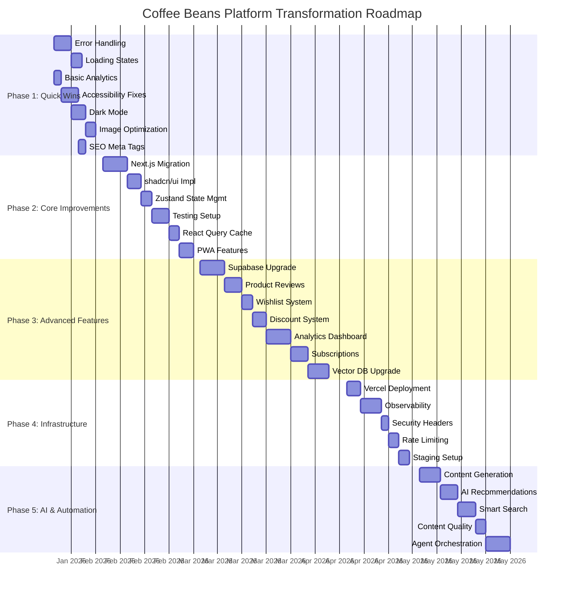
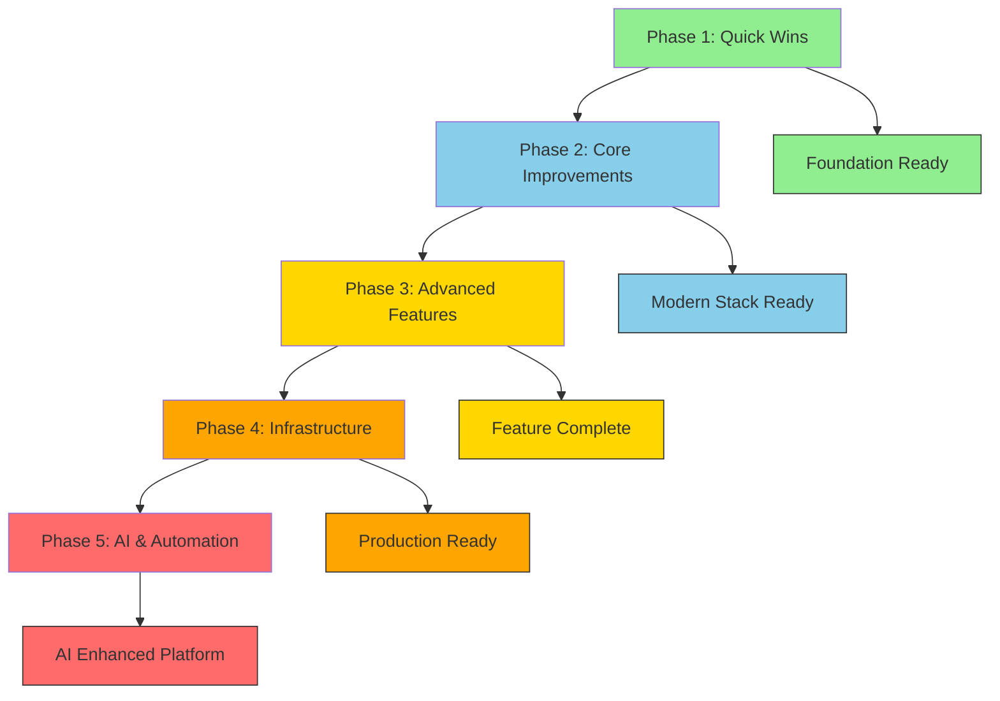

# PRD Roadmap
## Visual Timeline for Coffee Beans Platform Transformation

---

## Project Timeline Overview

---

## Phase Overviews

### Phase 1: Quick Wins (Weeks 1-2)
**Timeline:** January 20 - February 2, 2026
**Duration:** 2 weeks
**Budget:** $4,000-$6,000
**Team:** 1-2 developers

**Milestones:**
- ✅ Day 5: Error handling & loading states complete
- ✅ Day 10: Analytics and accessibility fixes done
- ✅ Day 14: Dark mode and image optimization complete
- ✅ Day 14: SEO meta tags implemented

**Deliverables:**
- Comprehensive error handling system
- Loading states throughout application
- Google Analytics 4 + Vercel Analytics tracking
- WCAG 2.1 AA compliance
- Dark mode with system preference
- Optimized images (WebP, lazy loading)
- Dynamic SEO meta tags and structured data

---

### Phase 2: Core Improvements (Weeks 3-6)
**Timeline:** February 3 - March 2, 2026
**Duration:** 4 weeks
**Budget:** $8,000-$10,000
**Team:** 2-3 developers

**Dependencies:** Phase 1 complete

**Milestones:**
- ✅ Day 7: Next.js migration complete
- ✅ Day 14: shadcn/ui components integrated
- ✅ Day 18: Zustand state management implemented
- ✅ Day 24: Comprehensive testing setup complete
- ✅ Day 28: React Query caching implemented
- ✅ Day 32: PWA features added

**Deliverables:**
- Next.js 15 App Router application
- shadcn/ui component library
- Zustand-based state management
- Vitest + Playwright test suite (>80% coverage)
- React Query caching and data fetching
- PWA with offline support

---

### Phase 3: Advanced Features (Weeks 7-12)
**Timeline:** March 3 - April 13, 2026
**Duration:** 6 weeks
**Budget:** $12,000-$16,000
**Team:** 2-3 developers

**Dependencies:** Phase 2 complete

**Milestones:**
- ✅ Day 7: Supabase migration complete
- ✅ Day 13: Product reviews & ratings live
- ✅ Day 17: Wishlist functionality complete
- ✅ Day 22: Discount code system working
- ✅ Day 30: Analytics dashboard deployed
- ✅ Day 36: Subscription support launched
- ✅ Day 43: Vector database for AI copilot

**Deliverables:**
- Supabase PostgreSQL database with RLS
- Product review system with ratings
- Wishlist feature with state persistence
- Discount code validation and application
- Real-time analytics dashboard
- Coffee subscription management
- Vector-based semantic search for AI

---

### Phase 4: Infrastructure (Weeks 13-15)
**Timeline:** April 14 - May 4, 2026
**Duration:** 3 weeks
**Budget:** $4,000-$6,000
**Team:** 1-2 developers + DevOps engineer

**Dependencies:** Phase 3 complete

**Milestones:**
- ✅ Day 4: Vercel deployment live
- ✅ Day 11: Full observability stack configured
- ✅ Day 14: Security headers implemented
- ✅ Day 18: Rate limiting active
- ✅ Day 21: Staging environment ready

**Deliverables:**
- Vercel production deployment
- Sentry error tracking
- LogRocket session replay
- Performance monitoring dashboards
- Security headers (CSP, HSTS, etc.)
- Rate limiting with Redis
- Separate staging environment

---

### Phase 5: AI & Automation (Weeks 16-19)
**Timeline:** May 5 - June 2, 2026
**Duration:** 4 weeks
**Budget:** $8,000-$10,000
**Team:** 1-2 developers + AI specialist

**Dependencies:** Phase 4 complete

**Milestones:**
- ✅ Day 6: Enhanced content generation workflow
- ✅ Day 12: AI product recommendations live
- ✅ Day 18: Smart search implemented
- ✅ Day 22: Automated content quality checks
- ✅ Day 30: Multi-agent orchestration enhanced

**Deliverables:**
- Improved AI content generation prompts
- Collaborative filtering recommendations
- Hybrid search (keyword + semantic)
- Automated quality scoring and review
- Refactored multi-agent system

---

## Critical Path

---

## Resource Allocation

### Team Composition

| Phase | Developers | DevOps | AI Specialist | QA | Total Headcount |
|--------|------------|---------|---------------|-----|-----------------|
| Phase 1 | 1-2 | 0 | 0 | 0-1 | 1-3 |
| Phase 2 | 2-3 | 0 | 0 | 1 | 3-4 |
| Phase 3 | 2-3 | 0 | 0 | 1 | 3-4 |
| Phase 4 | 1-2 | 1 | 0 | 1 | 3-4 |
| Phase 5 | 1-2 | 0 | 1 | 0-1 | 2-4 |

### Budget Allocation

| Phase | Development | Infrastructure | AI Services | Testing | Total |
|--------|-------------|---------------|------------|---------|--------|
| Phase 1 | $3,500-$5,000 | $0 | $0 | $500-$1,000 | $4,000-$6,000 |
| Phase 2 | $7,000-$8,500 | $0 | $0 | $1,000-$1,500 | $8,000-$10,000 |
| Phase 3 | $10,000-$13,000 | $500-$1,000 | $500-$1,000 | $1,000-$2,000 | $12,000-$16,000 |
| Phase 4 | $2,000-$3,000 | $1,000-$2,000 | $0 | $1,000-$1,000 | $4,000-$6,000 |
| Phase 5 | $6,000-$7,500 | $0 | $1,000-$2,000 | $1,000-$500 | $8,000-$10,000 |
| **Total** | **$28,500-$37,000** | **$1,500-$3,000** | **$1,500-$3,000** | **$5,500-$6,000** | **$36,000-$48,000** |

---

## Risk Assessment

### High Risk Items

| Risk | Impact | Probability | Mitigation |
|------|---------|-------------|------------|
| Next.js migration delays Phase 3 | High | Medium | Start early, allocate buffer time |
| Supabase migration data loss | High | Low | Backup Firebase, test thoroughly |
| Vector DB performance issues | Medium | Medium | Prototype early, optimize indexes |
| Developer availability | High | Medium | Hire contractors for critical paths |
| AI service API changes | Medium | Medium | Build abstraction layer, monitor changelog |

### Medium Risk Items

| Risk | Impact | Probability | Mitigation |
|------|---------|-------------|------------|
| Test coverage not met | Medium | Medium | Prioritize tests, add to definition of done |
| PWA compatibility issues | Medium | Medium | Test across browsers, fallback strategy |
| Rate limiting too strict | Medium | Medium | Start with generous limits, monitor usage |
| Stripe integration issues | Low | Medium | Extensive testing, fallback payment methods |
| Content quality issues | Medium | High | Manual review process, quality thresholds |

### Low Risk Items

| Risk | Impact | Probability | Mitigation |
|------|---------|-------------|------------|
| Security headers break functionality | Low | Low | Test thoroughly, rollback plan |
| Analytics privacy concerns | Low | Low | Follow GDPR, clear privacy policy |
| Deployment failures | Low | Low | Blue-green deployment, auto-rollback |
| Cost overruns | Medium | Low | Weekly budget reviews, scope management |

---

## Success Criteria

### Phase 1 Success Criteria
- [ ] All quick wins deployed to production
- [ ] Error rate reduced by 50%
- [ ] Page load time < 3s (from baseline)
- [ ] Accessibility score > 90
- [ ] Analytics tracking 100% of page views
- [ ] Dark mode adoption > 20%

### Phase 2 Success Criteria
- [ ] Next.js application live and stable
- [ ] 0 critical bugs in production
- [ ] Test coverage > 80%
- [ ] Build time < 2min
- [ ] Bundle size < 200KB
- [ ] PWA installable on all major browsers

### Phase 3 Success Criteria
- [ ] All Firebase data migrated successfully
- [ ] Supabase performance < 100ms p95
- [ ] Review submission rate > 10%
- [ ] Wishlist usage > 15% of users
- [ ] Discount redemption rate > 5%
- [ ] Dashboard used daily by admin
- [ ] Subscriptions > 5% of revenue
- [ ] AI search relevance > 80%

### Phase 4 Success Criteria
- [ ] Vercel deployment successful
- [ ] 0 downtime during deployment
- [ ] Error tracking capturing > 95% of errors
- [ ] Security headers all A+
- [ ] Rate limit violations < 0.1%
- [ ] Staging environment fully functional

### Phase 5 Success Criteria
- [ ] Content generation automation working
- [ ] Recommendation click-through rate > 3%
- [ ] Search conversion > 5%
- [ ] Content quality score > 85%
- [ ] Multi-agent response time < 10s

---

## Rollback Plan

### Critical Rollback Points

**After Phase 1:**
- If error handling causes issues: Revert to previous error handling
- If dark mode breaks: Disable via feature flag
- If SEO changes hurt ranking: Revert to previous meta tags

**After Phase 2:**
- If Next.js migration fails: Keep React version live
- If shadcn/ui breaks: Gradually migrate components
- If Zustand has bugs: Fall back to React Context

**After Phase 3:**
- If Supabase migration fails: Keep Firebase running
- If new features break: Feature flag each feature
- If Vector DB issues: Use old keyword search

**After Phase 4:**
- If Vercel deployment fails: Revert to Firebase Hosting
- If observability causes issues: Disable slowly
- If security headers break app: Remove offending headers

**After Phase 5:**
- If AI enhancements fail: Disable new features
- If automation issues: Revert to manual workflow
- If recommendations hurt UX: Hide recommendations

---

## Communication Plan

### Weekly Stakeholder Updates

**Week 1 (Phase 1):**
- Progress: Error handling, loading states complete
- Risks: None
- Next Week: Analytics, accessibility

**Week 2 (Phase 1 → 2):**
- Progress: Quick wins complete, starting Next.js migration
- Risks: Next.js migration complexity
- Next Week: shadcn/ui, state management

**Week 4 (Phase 2):**
- Progress: Core improvements 50% complete
- Risks: Test coverage targets
- Next Week: Complete Phase 2, start Supabase

**Week 8 (Phase 2 → 3):**
- Progress: Phase 2 complete, Supabase migration started
- Risks: Data migration timeline
- Next Week: Advanced features development

**Week 12 (Phase 3):**
- Progress: Advanced features complete
- Risks: None
- Next Week: Infrastructure setup

**Week 15 (Phase 3 → 4):**
- Progress: Infrastructure deployed
- Risks: Deployment stability
- Next Week: AI & automation

**Week 19 (Phase 4 → 5):**
- Progress: All phases complete
- Risks: None
- Next Week: Testing, optimization, launch

---

## Key Dates

### Milestones

| Milestone | Date | Description |
|-----------|-------|-------------|
| M1: Foundation Complete | Feb 2, 2026 | Quick wins live, error handling, analytics |
| M2: Modern Stack Ready | Mar 2, 2026 | Next.js, testing, caching complete |
| M3: Feature Complete | Apr 13, 2026 | All e-commerce features live |
| M4: Production Ready | May 4, 2026 | Infrastructure, security, monitoring ready |
| M5: AI Enhanced | Jun 2, 2026 | AI & automation enhancements complete |

### Deadlines

| Deadline | Date | Type |
|----------|-------|------|
| Phase 1 Complete | Feb 2, 2026 | Hard deadline |
| Phase 2 Complete | Mar 2, 2026 | Hard deadline |
| Phase 3 Complete | Apr 13, 2026 | Hard deadline |
| Phase 4 Complete | May 4, 2026 | Hard deadline |
| Phase 5 Complete | Jun 2, 2026 | Hard deadline |
| Production Launch | Jun 9, 2026 | Target launch (1 week buffer) |

---

## Dependencies

### External Dependencies

| Dependency | Owner | Status | Impact |
|------------|--------|--------|--------|
| OpenAI API | OpenAI | Contract active | Chat, embeddings critical |
| Supabase | Supabase | Account needed | Database hosting |
| Vercel | Vercel | Account needed | Deployment platform |
| Stripe | Stripe | Active | Payment processing |
| GitHub Actions | GitHub | Configured | CI/CD pipeline |

### Internal Dependencies

| Dependency | Phase | Blocking | Impact |
|------------|--------|----------|--------|
| Phase 1 Complete | Phase 2 | Yes | Cannot start modernization |
| Phase 2 Complete | Phase 3 | Yes | Cannot add advanced features |
| Phase 3 Complete | Phase 4 | Yes | Cannot setup production infrastructure |
| Phase 4 Complete | Phase 5 | Yes | Cannot enhance AI |

---

## Glossary

- **PWA**: Progressive Web Application
- **RLS**: Row Level Security
- **CSP**: Content Security Policy
- **HSTS**: HTTP Strict Transport Security
- **p95**: 95th percentile response time
- **SLA**: Service Level Agreement
- **RAG**: Retrieval-Augmented Generation
- **CI/CD**: Continuous Integration/Continuous Deployment
- **SEO**: Search Engine Optimization
- **WCAG**: Web Content Accessibility Guidelines

---

**Document Version:** 1.0
**Last Updated:** January 17, 2026
**Next Review:** February 1, 2026
