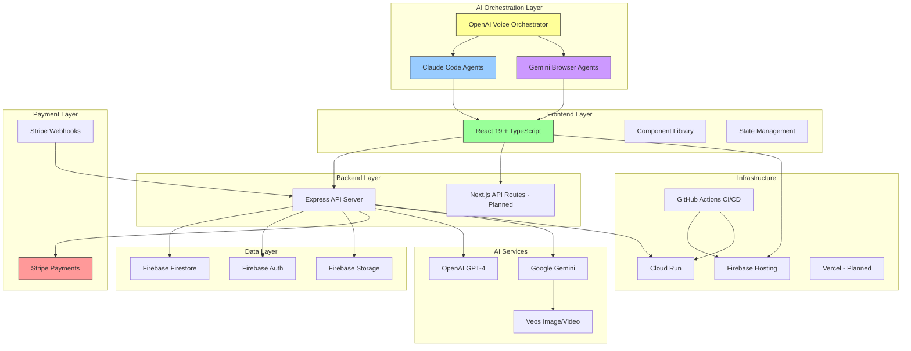
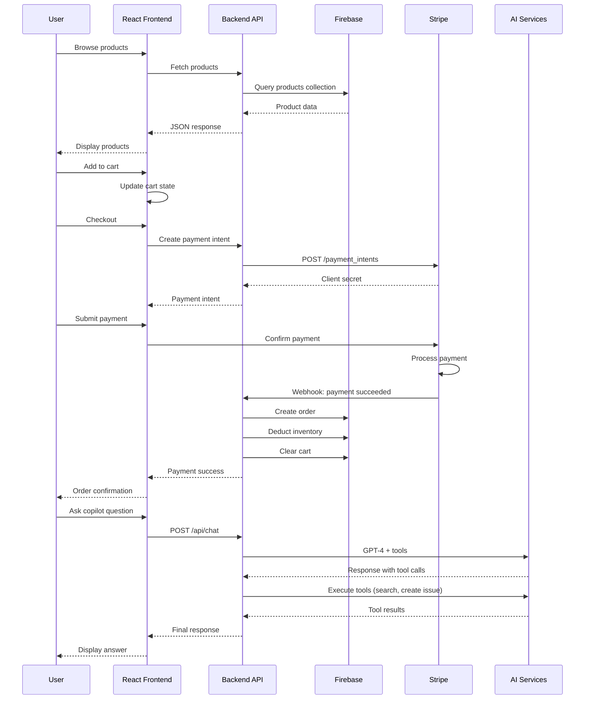

# Product Requirements Document (PRD)
## Coffee Beans Multi-AI Orchestration & E-Commerce Platform

---

## Table of Contents

1. [Executive Summary](#executive-summary)
2. [Component Analysis](#component-analysis)
3. [Architecture](#architecture)
4. [Improvement Recommendations](#improvement-recommendations)
5. [Recommended Tech Stack](#recommended-tech-stack)
6. [Migration Priority](#migration-priority)
7. [Estimated Costs](#estimated-costs)
8. [Success Metrics](#success-metrics)

---

## Executive Summary

This is a sophisticated AI-powered development and e-commerce platform consisting of:

- **Big Three Realtime Agents** - Voice-controlled AI orchestrator managing coding and browser agents
- **Premium Coffee E-Commerce Site** - Full e-commerce with AI content generation, Stripe payments, Firebase backend
- **Claude Skills System** - 30+ specialized skills for reusable patterns and best practices
- **Automated Workflows** - GitHub Actions for CI/CD, content generation, and deployment

The platform demonstrates advanced AI integration capabilities with practical e-commerce functionality, serving as both a working application and a reference implementation for AI-powered development workflows.

---

## Component Analysis

### 1. Big Three Realtime Agents
**Location:** `apps/realtime-poc/big_three_realtime_agents.py` (3,239 lines)

**Purpose:** Voice-controlled orchestrator coordinating multiple AI agents

**Key Features:**
- OpenAI Realtime API for natural voice interactions
- Claude Code agents for software development
- Gemini browser agents for web automation
- Multi-agent observability dashboard
- Session management and agent lifecycle
- Tool-based dispatch system

**Tech Stack:**
- Python 3.11+
- Astral uv (package management)
- Playwright (browser automation)
- OpenAI, Anthropic, Google Gemini APIs

**Current Structure:**
- Line 184-616: `GeminiBrowserAgent` class
- Line 617-1540: `ClaudeCodeAgenticCoder` class
- Line 1541-2900: `OpenAIRealtimeVoiceAgent` class
- Working directory: `apps/content-gen/` (configurable)

---

### 2. Coffee Website React
**Location:** `coffee-website-react/`

**Purpose:** Premium e-commerce coffee shop with AI integrations

**Key Features:**
- Shopping cart with Stripe payment processing
- AI-powered coffee copilot (RAG + GitHub issue creation)
- Firebase authentication and Firestore database
- Seasonal AI-generated content (videos/images via Gemini)
- Admin dashboard with inventory management
- Blog system with automated newsletter distribution
- Gift cards and location map integration
- Custom cursor and advanced animations

**Tech Stack:**
- React 19 + TypeScript
- Vite (build tool)
- Tailwind CSS + Framer Motion
- Firebase (Auth, Firestore, Storage, Hosting)
- Stripe (payments)
- OpenAI (AI copilot)
- Google Gemini (content generation)
- Express (unified backend - 991 lines)

**Component Count:** 41 TypeScript files

**Backend Endpoints:**
- `/api/chat` - AI copilot chat
- `/api/feedback` - Bug report submission with screenshots
- `/api/create-payment-intent` - Stripe payment creation
- `/api/stripe-webhook` - Payment event handling
- `/api/admin/orders` - Order management
- `/api/admin/stats` - Dashboard statistics
- `/api/admin/inventory-logs` - Inventory tracking

---

### 3. Stockbridge Coffee AI Creative Studio
**Location:** `stockbridge-coffee---ai-creative-studio/`

**Purpose:** Simple creative studio for coffee-related content

**Key Features:**
- Hero, Shop, and Create views
- Navigation system
- Footer integration
- Simple SPA routing

**Tech Stack:**
- React + TypeScript
- Tailwind CSS
- Basic component structure

---

### 4. Claude Skills System
**Location:** `.claude/skills/`

**Purpose:** 30+ specialized skills for reusable development patterns

**Skills Include:**
- `ai-content-manager` - Seasonal video/image generation
- `coffee-copilot` - AI chatbot implementation
- `firebase-coffee-integration` - Firebase integration patterns
- `stripe-integration` - Payment processing
- `logo-manager` - Logo management and optimization
- `premium-coffee-website` - Premium website patterns
- `secrets-manager` - Secret management workflows
- `github-actions-orchestrator` - CI/CD workflow management
- `webapp-testing` - Playwright testing toolkit
- `cloudflare-firebase-domain` - DNS configuration
- `frontend-enhancer` - UI/UX improvements
- `brand-analyzer` - Brand guidelines
- `business-document-generator` - Business document creation
- `cicd-pipeline-generator` - CI/CD setup
- `codebase-documenter` - Documentation automation
- `data-analyst` - CSV data analysis
- `csv-data-visualizer` - Interactive dashboards
- `docx/pptx/pdf/xlsx` - Document manipulation
- `finance-manager` - Personal finance tracking
- `nutritional-specialist` - Food/nutrition advice
- `personal-assistant` - Task/schedule management
- `pitch-deck` - PowerPoint generation
- `research-paper-writer` - Academic papers
- `resume-manager` - Resume creation
- `script-writer` - YouTube scripts
- `seo-optimizer` - SEO analysis
- `social-media-generator` - Social media posts
- `storyboard-manager` - Story planning
- `startup-validator` - Idea validation
- `tech-debt-analyzer` - Code quality analysis
- `test-specialist` - Test case writing
- `travel-planner` - Trip planning

---

### 5. Automated Workflows
**Location:** `.github/workflows/`

**Workflows:**
- `firebase-production.yml` - Production deployment
- `firebase-preview.yml` - Preview deployments on PRs
- `playwright.yml` - E2E testing
- `claude-code-review-fast.yml` - Fast code review
- `claude-code-review-custom.yml` - Custom code review (disabled)
- `deploy-backend.yml` - Backend deployment to Cloud Run
- `generate-weekly-content.yml` - Weekly AI content generation
- `weekly-blog-newsletter.yml` - Blog and newsletter automation

---

## Architecture

### System Architecture Diagram



### Data Flow



---

## Improvement Recommendations

### Critical Improvements (#1-10)

#### 1. Split 3,239-line Monolith
**Problem:** `big_three_realtime_agents.py` is too large and difficult to maintain

**Solution:** Refactor into modular structure

```
apps/realtime-poc/
├── core/
│   ├── orchestrator.py      # Main orchestration logic
│   ├── agent_registry.py    # Agent session management
│   └── event_bus.py        # Inter-agent communication
├── agents/
│   ├── voice_orchestrator.py
│   ├── claude_coder.py
│   ├── gemini_browser.py
│   └── base_agent.py
├── tools/
│   ├── file_operations.py
│   ├── browser_tools.py
│   └── github_integration.py
├── config/
│   ├── settings.py
│   └── prompts.py
└── tests/
    ├── test_orchestrator.py
    ├── test_agents.py
    └── test_tools.py
```

**Benefits:**
- Modular, testable, maintainable
- Easier to add new agent types
- Better separation of concerns
- Clearer code organization

**Estimated Effort:** 40-60 hours

---

#### 2. Modernize with Next.js App Router
**Current:** React 19 with Vite
**Recommended:** Next.js 15 App Router

**Why Migrate:**
- Built-in API routes (no separate Express backend)
- Server Components for better performance
- Built-in image optimization
- Better SEO with metadata API
- Simplified deployment (Vercel integration)
- Streaming support for AI responses

**Migration Path:**

**Phase 1: Setup**
```bash
npx create-next-app@latest coffee-website-nextjs
cd coffee-website-nextjs
npm install @radix-ui/react-dialog @radix-ui/react-dropdown-menu
```

**Phase 2: Convert Components**
- Move React components to `app/` directory
- Convert to Server Components where possible
- Keep Client Components for interactivity

**Phase 3: Migrate API Routes**
```typescript
// Express route: server/index.ts
app.post('/api/chat', async (req, res) => { ... })

// Next.js route: app/api/chat/route.ts
export async function POST(request: Request) { ... }
```

**Phase 4: Update State Management**
- Use React hooks for local state
- Use Server Actions for mutations
- Implement caching with React Query

**Estimated Effort:** 60-80 hours

---

#### 3. Implement State Management with Zustand
**Current:** React Context hooks scattered across components
**Recommended:** Zustand for client state

**Why Zustand:**
- Simpler API than Redux/Context
- Zero boilerplate
- TypeScript support
- No provider wrapping needed
- DevTools integration
- Tiny bundle size (1KB)

**Implementation:**

```typescript
// store/cart.ts
import { create } from 'zustand'
import { persist } from 'zustand/middleware'

interface CartItem {
  id: string
  name: string
  price: number
  quantity: number
}

interface CartStore {
  items: CartItem[]
  addToCart: (item: CartItem) => void
  removeFromCart: (id: string) => void
  updateQuantity: (id: string, quantity: number) => void
  clearCart: () => void
  subtotal: number
  total: number
}

export const useCartStore = create<CartStore>()(
  persist(
    (set, get) => ({
      items: [],
      addToCart: (item) => set((state) => ({
        items: [...state.items, item]
      })),
      removeFromCart: (id) => set((state) => ({
        items: state.items.filter((item) => item.id !== id)
      })),
      updateQuantity: (id, quantity) => set((state) => ({
        items: state.items.map((item) =>
          item.id === id ? { ...item, quantity } : item
        )
      })),
      clearCart: () => set({ items: [] }),
      get subtotal() {
        return get().items.reduce((sum, item) => sum + item.price * item.quantity, 0)
      },
      get total() {
        return get().subtotal * 1.2 // 20% tax
      }
    }),
    {
      name: 'cart-storage'
    }
  )
)
```

**Usage:**
```typescript
// Component
import { useCartStore } from '@/store/cart'

function ProductCard({ product }) {
  const { addToCart } = useCartStore()

  return (
    <button onClick={() => addToCart(product)}>
      Add to Cart
    </button>
  )
}
```

**Estimated Effort:** 16-24 hours

---

#### 4. Upgrade from Firebase to Supabase
**Current:** Firebase Firestore (NoSQL)
**Recommended:** Supabase (PostgreSQL)

**Why Supabase:**
- SQL > NoSQL for structured e-commerce data
- Real-time still available
- Built-in auth (same as Firebase)
- Better query capabilities (joins, aggregations)
- Row-level security
- Supabase Studio (admin UI)
- PostgreSQL features: full-text search, JSONB, extensions
- Lower long-term costs

**Migration Plan:**

**Step 1: Setup Supabase**
```bash
npm install @supabase/supabase-js
npm install @supabase/auth-helpers-nextjs
```

**Step 2: Create Schema**
```sql
-- Products table
CREATE TABLE products (
  id UUID PRIMARY KEY DEFAULT gen_random_uuid(),
  name TEXT NOT NULL,
  description TEXT,
  price DECIMAL(10,2) NOT NULL,
  category TEXT,
  stock INTEGER DEFAULT 0,
  image TEXT,
  created_at TIMESTAMP DEFAULT NOW(),
  updated_at TIMESTAMP DEFAULT NOW()
);

-- Orders table
CREATE TABLE orders (
  id UUID PRIMARY KEY DEFAULT gen_random_uuid(),
  user_id UUID REFERENCES auth.users(id),
  status TEXT DEFAULT 'processing',
  total DECIMAL(10,2) NOT NULL,
  created_at TIMESTAMP DEFAULT NOW(),
  updated_at TIMESTAMP DEFAULT NOW()
);

-- Order items
CREATE TABLE order_items (
  id UUID PRIMARY KEY DEFAULT gen_random_uuid(),
  order_id UUID REFERENCES orders(id),
  product_id UUID REFERENCES products(id),
  quantity INTEGER NOT NULL,
  price DECIMAL(10,2) NOT NULL
);

-- Full-text search
CREATE INDEX products_name_search ON products USING GIN(to_tsvector('english', name));
```

**Step 3: Replace Firebase Calls**

```typescript
// Before: Firebase
import { getFirestore, collection, getDocs } from 'firebase/firestore'

const products = await getDocs(collection(db, 'products'))

// After: Supabase
import { createClient } from '@supabase/supabase-js'

const supabase = createClient(
  process.env.NEXT_PUBLIC_SUPABASE_URL,
  process.env.NEXT_PUBLIC_SUPABASE_ANON_KEY
)

const { data: products } = await supabase
  .from('products')
  .select('*')
```

**Step 4: Migration Scripts**
```typescript
// scripts/migrate-firebase-to-supabase.ts
import { initializeApp } from 'firebase/app'
import { getFirestore, collection, getDocs } from 'firebase/firestore'
import { createClient } from '@supabase/supabase-js'

const firebaseApp = initializeApp({...})
const firebaseDb = getFirestore(firebaseApp)
const supabase = createClient(...)

async function migrateProducts() {
  const snapshot = await getDocs(collection(firebaseDb, 'products'))

  for (const doc of snapshot.docs) {
    await supabase.from('products').insert(doc.data())
  }
}

migrateProducts()
```

**Estimated Effort:** 40-60 hours

---

#### 5. Comprehensive Test Suite
**Current:** Limited Playwright tests
**Recommended:** Multi-layer testing strategy

**Test Structure:**
```
tests/
├── unit/              # Vitest
│   ├── hooks/
│   │   └── useCart.test.ts
│   ├── components/
│   │   └── ProductCard.test.tsx
│   └── utils/
│       └── currency.test.ts
├── integration/       # Vitest + MSW
│   ├── api/
│   │   └── cart.test.ts
│   └── firebase/
│       └── auth.test.ts
└── e2e/             # Playwright
    ├── flows/
    │   ├── checkout.spec.ts
    │   ├── cart.spec.ts
    │   └── auth.spec.ts
    └── pages/
        ├── home.spec.ts
        └── product.spec.ts
```

**Setup:**
```bash
npm install -D vitest @testing-library/react @testing-library/jest-dom
npm install -D msw @playwright/test
```

**Unit Test Example:**
```typescript
// tests/unit/hooks/useCart.test.ts
import { renderHook, act } from '@testing-library/react'
import { useCartStore } from '@/store/cart'

describe('useCartStore', () => {
  beforeEach(() => {
    useCartStore.getState().clearCart()
  })

  it('should add item to cart', () => {
    const { result } = renderHook(() => useCartStore())

    act(() => {
      result.current.addToCart({
        id: '1',
        name: 'Coffee',
        price: 10,
        quantity: 1
      })
    })

    expect(result.current.items).toHaveLength(1)
  })

  it('should calculate subtotal correctly', () => {
    const { result } = renderHook(() => useCartStore())

    act(() => {
      result.current.addToCart({ id: '1', name: 'A', price: 10, quantity: 2 })
    })

    expect(result.current.subtotal).toBe(20)
  })
})
```

**E2E Test Example:**
```typescript
// tests/e2e/flows/checkout.spec.ts
import { test, expect } from '@playwright/test'

test.describe('Checkout Flow', () => {
  test('should complete checkout successfully', async ({ page }) => {
    await page.goto('/')

    await page.click('[data-testid="product-1"]')
    await page.click('text=Add to Cart')
    await page.click('[data-testid="cart-icon"]')
    await page.click('text=Checkout')

    await page.fill('[data-testid="card-number"]', '4242 4242 4242 4242')
    await page.fill('[data-testid="card-expiry"]', '12/34')
    await page.fill('[data-testid="card-cvc"]', '123')
    await page.click('text=Pay')

    await expect(page.locator('text=Order confirmed')).toBeVisible()
  })
})
```

**Estimated Effort:** 40-60 hours

---

#### 6. Add OAuth Authentication Providers
**Current:** Basic Firebase Auth
**Recommended:** Multiple OAuth providers

**Providers to Add:**
- Google OAuth
- Apple Sign-in
- Email/password
- Magic link authentication

**Implementation:**

```typescript
// app/auth/callback/route.ts
import { createRouteHandlerClient } from '@supabase/auth-helpers-nextjs'
import { cookies } from 'next/headers'

export async function GET(request: Request) {
  const requestUrl = new URL(request.url)
  const code = requestUrl.searchParams.get('code')

  if (code) {
    const supabase = createRouteHandlerClient({ cookies })
    await supabase.auth.exchangeCodeForSession(code)
  }

  return Response.redirect(new URL('/dashboard', request.url))
}
```

**Login Component:**
```typescript
// components/AuthButton.tsx
import { signInWithGoogle, signInWithApple } from '@/lib/auth'

export function AuthButton() {
  return (
    <div className="flex flex-col gap-2">
      <button onClick={signInWithGoogle}>
        Continue with Google
      </button>
      <button onClick={signInWithApple}>
        Continue with Apple
      </button>
    </div>
  )
}
```

**Estimated Effort:** 16-24 hours

---

#### 7. Implement Headless CMS
**Current:** Firebase Storage + Firestore
**Recommended:** Sanity.io or Strapi

**Why Headless CMS:**
- Rich text editing (block-based)
- Image optimization built-in
- Draft/publish workflow
- Webhooks for build triggers
- Content scheduling
- Multi-language support
- Better content authoring experience

**Sanity.io Setup:**
```bash
npm install sanity
npx create-sanity@latest
```

**Content Model:**
```javascript
// sanity/schemas/product.js
export default {
  name: 'product',
  type: 'document',
  fields: [
    { name: 'name', type: 'string', title: 'Name' },
    { name: 'description', type: 'text', title: 'Description' },
    { name: 'price', type: 'number', title: 'Price' },
    { name: 'category', type: 'reference', to: 'category' },
    { name: 'image', type: 'image', title: 'Image' },
    { name: 'stock', type: 'number', title: 'Stock' },
    { name: 'active', type: 'boolean', title: 'Active' }
  ]
}
```

**Fetch Content:**
```typescript
// lib/sanity.ts
import { createClient } from 'next-sanity'

export const client = createClient({
  projectId: process.env.NEXT_PUBLIC_SANITY_PROJECT_ID,
  dataset: 'production',
  apiVersion: '2024-01-01',
  useCdn: true
})

export async function getProducts() {
  return client.fetch(`
    *[_type == 'product' && active == true] | order(name asc)
  `)
}
```

**Estimated Effort:** 24-32 hours

---

#### 8. Implement Caching Strategy
**Current:** No caching
**Recommended:** Multi-layer caching

**Cache Layers:**
- React Query for API caching
- Service Worker for offline support
- Image CDN (Cloudinary/Imgix)
- Redis for server-side caching

**React Query Setup:**
```bash
npm install @tanstack/react-query
```

**Provider:**
```typescript
// app/providers.tsx
'use client'

import { QueryClient, QueryClientProvider } from '@tanstack/react-query'

const queryClient = new QueryClient({
  defaultOptions: {
    queries: {
      staleTime: 60 * 1000, // 1 minute
      cacheTime: 5 * 60 * 1000, // 5 minutes
      refetchOnWindowFocus: false
    }
  }
})

export function Providers({ children }: { children: React.ReactNode }) {
  return (
    <QueryClientProvider client={queryClient}>
      {children}
    </QueryClientProvider>
  )
}
```

**Usage:**
```typescript
// components/ProductList.tsx
import { useQuery } from '@tanstack/react-query'

export function ProductList() {
  const { data: products, isLoading } = useQuery({
    queryKey: ['products'],
    queryFn: fetchProducts,
    staleTime: 5 * 60 * 1000, // 5 minutes
  })

  if (isLoading) return <div>Loading...</div>

  return (
    <div>
      {products?.map(product => (
        <ProductCard key={product.id} product={product} />
      ))}
    </div>
  )
}
```

**Redis Caching:**
```typescript
// lib/redis.ts
import { Redis } from 'ioredis'

const redis = new Redis(process.env.REDIS_URL)

export async function cacheGet<T>(key: string): Promise<T | null> {
  const cached = await redis.get(key)
  return cached ? JSON.parse(cached) : null
}

export async function cacheSet(key: string, value: any, ttl: number = 3600) {
  await redis.setex(key, ttl, JSON.stringify(value))
}

// Usage
export async function getProducts() {
  const cached = await cacheGet<Product[]>('products')
  if (cached) return cached

  const products = await fetchFromDB()
  await cacheSet('products', products, 300) // 5 minutes
  return products
}
```

**Estimated Effort:** 20-32 hours

---

#### 9. Implement Dynamic SEO Meta Tags
**Current:** Static meta tags
**Recommended:** Next.js Metadata API

**Implementation:**

```typescript
// app/layout.tsx
export const metadata = {
  title: 'Stockbridge Coffee Roastery',
  description: 'Premium single-origin coffee beans',
  openGraph: {
    title: 'Stockbridge Coffee Roastery',
    description: 'Premium single-origin coffee beans',
    images: ['/og-image.jpg']
  }
}

// app/products/[id]/page.tsx
export async function generateMetadata({ params }: PageProps) {
  const product = await getProduct(params.id)

  return {
    title: product.name,
    description: product.description,
    openGraph: {
      title: product.name,
      description: product.description,
      images: [product.image]
    },
    alternates: {
      canonical: `/products/${product.id}`
    }
  }
}
```

**Structured Data (JSON-LD):**
```typescript
// components/StructuredData.tsx
export function ProductStructuredData({ product }: { product: Product }) {
  const jsonLd = {
    '@context': 'https://schema.org/',
    '@type': 'Product',
    name: product.name,
    description: product.description,
    image: product.image,
    offers: {
      '@type': 'Offer',
      price: product.price,
      priceCurrency: 'GBP',
      availability: product.stock > 0 ? 'https://schema.org/InStock' : 'https://schema.org/OutOfStock'
    }
  }

  return (
    <script
      type="application/ld+json"
      dangerouslySetInnerHTML={{ __html: JSON.stringify(jsonLd) }}
    />
  )
}
```

**Sitemap Generation:**
```typescript
// app/sitemap.ts
import { MetadataRoute } from 'next'

export default async function sitemap(): Promise<MetadataRoute.Sitemap> {
  const products = await getProducts()

  return [
    {
      url: 'https://stockbridgecoffee.co.uk',
      lastModified: new Date(),
      changeFrequency: 'daily',
      priority: 1
    },
    ...products.map(product => ({
      url: `https://stockbridgecoffee.co.uk/products/${product.id}`,
      lastModified: product.updatedAt,
      changeFrequency: 'weekly',
      priority: 0.8
    }))
  ]
}
```

**Estimated Effort:** 16-24 hours

---

#### 10. Add Comprehensive Analytics
**Current:** None
**Recommended:** Multi-platform analytics

**Setup:**

```bash
# Google Analytics 4
npm install @next/third-parties

# PostHog
npm install posthog-js

# Vercel Analytics
npm install @vercel/analytics
```

**Google Analytics:**
```typescript
// app/layout.tsx
import { GoogleAnalytics } from '@next/third-parties/google'

export default function RootLayout({ children }) {
  return (
    <html>
      <body>
        {children}
        <GoogleAnalytics gaId="GA_MEASUREMENT_ID" />
      </body>
    </html>
  )
}
```

**PostHog:**
```typescript
// lib/posthog.ts
import posthog from 'posthog-js'

if (typeof window !== 'undefined') {
  posthog.init(process.env.NEXT_PUBLIC_POSTHOG_KEY, {
    api_host: 'https://app.posthog.com'
  })
}

export function trackEvent(name: string, properties?: any) {
  posthog.capture(name, properties)
}

// Usage
trackEvent('add_to_cart', { product_id: '123' })
trackEvent('checkout_completed', { total: 50 })
```

**Vercel Analytics:**
```typescript
// app/layout.tsx
import { Analytics } from '@vercel/analytics/react'

export default function RootLayout({ children }) {
  return (
    <html>
      <body>
        {children}
        <Analytics />
      </body>
    </html>
  )
}
```

**Custom Dashboard:**
```typescript
// app/analytics/page.tsx
export default async function AnalyticsPage() {
  const metrics = await getAnalyticsMetrics()

  return (
    <div>
      <MetricsOverview metrics={metrics} />
      <RevenueChart data={metrics.revenue} />
      <TopProducts data={metrics.products} />
      <UserJourneys data={metrics.journeys} />
    </div>
  )
}
```

**Estimated Effort:** 16-24 hours

---

### UI/UX Improvements (#11-15)

#### 11. Implement shadcn/ui Component Library
**Current:** Custom components with Tailwind
**Recommended:** shadcn/ui component library

**Why shadcn/ui:**
- Pre-built, accessible components
- Radix UI primitives (excellent accessibility)
- Tailwind-based (consistent styling)
- Copy-paste (no dependencies)
- Dark mode support built-in
- Highly customizable

**Setup:**
```bash
npx shadcn-ui@latest init
```

**Install Components:**
```bash
npx shadcn-ui@latest add button
npx shadcn-ui@latest add card
npx shadcn-ui@latest add dialog
npx shadcn-ui@latest add dropdown-menu
npx shadcn-ui@latest add toast
npx shadcn-ui@latest add select
npx shadcn-ui@latest add input
npx shadcn-ui@latest add form
```

**Migration Example:**
```typescript
// Before: Custom Button
const Button = ({ children, onClick }) => (
  <button
    onClick={onClick}
    className="px-4 py-2 bg-coffee-700 text-white rounded-lg hover:bg-coffee-800"
  >
    {children}
  </button>
)

// After: shadcn/ui Button
import { Button } from '@/components/ui/button'

<Button>Add to Cart</Button>
```

**Estimated Effort:** 24-32 hours

---

#### 12. Enhance Animations with Auto-Animate
**Current:** Framer Motion
**Recommended:** Add Auto-Animate for smooth transitions

**Setup:**
```bash
npm install @formkit/auto-animate
```

**Usage:**
```typescript
'use client'

import { useAutoAnimate } from '@formkit/auto-animate/react'

export function ProductList() {
  const [parent, enableAnimations] = useAutoAnimate()

  return (
    <ul ref={parent}>
      {products.map(product => (
        <li key={product.id}>{product.name}</li>
      ))}
    </ul>
  )
}
```

**Cart Animation:**
```typescript
export function CartDrawer() {
  const [parent] = useAutoAnimate()

  return (
    <div ref={parent}>
      {cartItems.map(item => (
        <CartItem key={item.id} item={item} />
      ))}
    </div>
  )
}
```

**Estimated Effort:** 8-12 hours

---

#### 13. Implement Progressive Web App (PWA)
**Current:** Responsive design
**Recommended:** Full PWA capabilities

**Setup:**
```bash
npm install next-pwa
```

**Configuration:**
```typescript
// next.config.js
const withPWA = require('next-pwa')({
  dest: 'public',
  register: true,
  skipWaiting: true,
  disable: process.env.NODE_ENV === 'development'
})

module.exports = withPWA({
  // Your Next.js config
})
```

**Manifest:**
```json
// public/manifest.json
{
  "name": "Stockbridge Coffee",
  "short_name": "Stockbridge",
  "description": "Premium coffee roastery",
  "start_url": "/",
  "display": "standalone",
  "background_color": "#6B4423",
  "theme_color": "#6B4423",
  "icons": [
    {
      "src": "/icon-192.png",
      "sizes": "192x192",
      "type": "image/png"
    },
    {
      "src": "/icon-512.png",
      "sizes": "512x512",
      "type": "image/png"
    }
  ]
}
```

**Install Prompt:**
```typescript
'use client'

import { useEffect, useState } from 'react'

export function InstallPWA() {
  const [deferredPrompt, setDeferredPrompt] = useState<any>(null)
  const [showInstall, setShowInstall] = useState(false)

  useEffect(() => {
    const handler = (e: Event) => {
      e.preventDefault()
      setDeferredPrompt(e)
      setShowInstall(true)
    }

    window.addEventListener('beforeinstallprompt', handler)
    return () => window.removeEventListener('beforeinstallprompt', handler)
  }, [])

  const handleInstall = async () => {
    if (deferredPrompt) {
      deferredPrompt.prompt()
      const { outcome } = await deferredPrompt.userChoice
      if (outcome === 'accepted') {
        setShowInstall(false)
      }
    }
  }

  if (!showInstall) return null

  return (
    <button onClick={handleInstall}>
      Install App
    </button>
  )
}
```

**Estimated Effort:** 16-24 hours

---

#### 14. Add Dark Mode with System Preference
**Current:** Not implemented
**Recommended:** Dark mode with system detection

**Setup:**
```typescript
// hooks/useTheme.ts
'use client'

import { useEffect, useState } from 'react'

type Theme = 'light' | 'dark' | 'system'

export function useTheme() {
  const [theme, setTheme] = useState<Theme>('system')

  useEffect(() => {
    const root = document.documentElement

    const applyTheme = (t: Theme) => {
      const isDark =
        t === 'dark' ||
        (t === 'system' && window.matchMedia('(prefers-color-scheme: dark)').matches)

      root.classList.toggle('dark', isDark)
      localStorage.setItem('theme', t)
    }

    applyTheme(theme)
  }, [theme])

  return { theme, setTheme }
}
```

**Theme Toggle Component:**
```typescript
'use client'

import { useTheme } from '@/hooks/useTheme'
import { Sun, Moon, Monitor } from 'lucide-react'

export function ThemeToggle() {
  const { theme, setTheme } = useTheme()

  return (
    <div className="flex gap-2">
      <button
        onClick={() => setTheme('light')}
        className={theme === 'light' ? 'bg-coffee-700' : ''}
      >
        <Sun className="w-4 h-4" />
      </button>
      <button
        onClick={() => setTheme('dark')}
        className={theme === 'dark' ? 'bg-coffee-700' : ''}
      >
        <Moon className="w-4 h-4" />
      </button>
      <button
        onClick={() => setTheme('system')}
        className={theme === 'system' ? 'bg-coffee-700' : ''}
      >
        <Monitor className="w-4 h-4" />
      </button>
    </div>
  )
}
```

**Tailwind Config:**
```javascript
// tailwind.config.js
module.exports = {
  darkMode: ['class'],
  theme: {
    extend: {
      colors: {
        coffee: {
          50: '#FDF8F3',
          100: '#FAEDE2',
          700: '#6B4423',
          900: '#3D2B1F'
        }
      }
    }
  }
}
```

**Estimated Effort:** 12-16 hours

---

#### 15. Full WCAG 2.1 AA Compliance
**Current:** Basic accessibility
**Recommended:** Comprehensive accessibility

**Checklist:**

**Keyboard Navigation:**
- [ ] All interactive elements keyboard accessible
- [ ] Focus indicators visible
- [ ] Skip to main content link
- [ ] Logical tab order

**Screen Reader Support:**
- [ ] ARIA labels on interactive elements
- [ ] Alt text on all images
- [ ] Semantic HTML structure
- [ ] Live regions for dynamic content

**Color Contrast:**
- [ ] Minimum 4.5:1 for text
- [ ] Minimum 3:1 for large text
- [ ] Don't use color alone to convey meaning

**Focus Management:**
- [ ] Focus trapped in modals
- [ ] Focus returned after modal closes
- [ ] Focus moved to new content after navigation

**Tools:**
```bash
# Install testing tools
npm install -D @axe-core/react jest-axe

# Run automated tests
npm run test:a11y
```

**Component Example:**
```typescript
// components/AccessibleButton.tsx
interface AccessibleButtonProps {
  onClick: () => void
  children: React.ReactNode
  ariaLabel?: string
  disabled?: boolean
}

export function AccessibleButton({
  onClick,
  children,
  ariaLabel,
  disabled = false
}: AccessibleButtonProps) {
  return (
    <button
      onClick={onClick}
      aria-label={ariaLabel}
      disabled={disabled}
      className="px-4 py-2 bg-coffee-700 text-white rounded-lg
                 hover:bg-coffee-800 focus:outline-none focus:ring-2
                 focus:ring-offset-2 focus:ring-coffee-700
                 disabled:opacity-50 disabled:cursor-not-allowed"
    >
      {children}
    </button>
  )
}
```

**Testing:**
```typescript
// tests/accessibility/button.test.tsx
import { render, screen } from '@testing-library/react'
import { AxeResults } from 'axe-core'
import { AccessibleButton } from '@/components/AccessibleButton'

describe('AccessibleButton', () => {
  it('should have no accessibility violations', async () => {
    const { container } = render(
      <AccessibleButton onClick={() => {}}>
        Click Me
      </AccessibleButton>
    )

    const results = await axe(container)
    expect(results).toHaveNoViolations()
  })

  it('should be keyboard accessible', () => {
    render(<AccessibleButton onClick={() => {}}>Click Me</AccessibleButton>)

    const button = screen.getByRole('button')
    button.focus()
    expect(button).toHaveFocus()

    // Test Enter key
    button.dispatchEvent(new KeyboardEvent('keydown', { key: 'Enter' }))
    button.dispatchEvent(new KeyboardEvent('keyup', { key: 'Enter' }))
  })
})
```

**Estimated Effort:** 24-32 hours

---

### DevOps & Infrastructure (#16-20)

#### 16. Enhance GitHub Actions CI/CD
**Current:** Basic workflows
**Recommended:** Comprehensive pipeline

**Pipeline Structure:**

```
.github/workflows/
├── ci.yml                     # On every PR
├── preview.yml                # On PR to main
├── staging.yml                # On merge to staging
├── production.yml             # On merge to main
├── content-generation.yml     # Weekly
└── maintenance.yml           # Manual trigger
```

**CI Workflow:**
```yaml
# .github/workflows/ci.yml
name: CI

on:
  pull_request:
    branches: ['**']

jobs:
  lint:
    runs-on: ubuntu-latest
    steps:
      - uses: actions/checkout@v4
      - uses: actions/setup-node@v4
        with:
          node-version: 20
      - run: npm ci
      - run: npm run lint

  type-check:
    runs-on: ubuntu-latest
    steps:
      - uses: actions/checkout@v4
      - uses: actions/setup-node@v4
      - run: npm ci
      - run: npm run type-check

  unit-tests:
    runs-on: ubuntu-latest
    steps:
      - uses: actions/checkout@v4
      - uses: actions/setup-node@v4
      - run: npm ci
      - run: npm run test:unit

  build:
    runs-on: ubuntu-latest
    needs: [lint, type-check, unit-tests]
    steps:
      - uses: actions/checkout@v4
      - uses: actions/setup-node@v4
      - run: npm ci
      - run: npm run build

  security-scan:
    runs-on: ubuntu-latest
    steps:
      - uses: actions/checkout@v4
      - uses: snyk/actions/node@master
        env:
          SNYK_TOKEN: ${{ secrets.SNYK_TOKEN }}
```

**Preview Deployment:**
```yaml
# .github/workflows/preview.yml
name: Preview Deployment

on:
  pull_request:
    branches: [main]

jobs:
  deploy:
    runs-on: ubuntu-latest
    steps:
      - uses: actions/checkout@v4
      - uses: amondnet/vercel-action@v25
        with:
          vercel-token: ${{ secrets.VERCEL_TOKEN }}
          vercel-org-id: ${{ secrets.VERCEL_ORG_ID }}
          vercel-project-id: ${{ secrets.VERCEL_PROJECT_ID }}
          vercel-args: '--preview'

  e2e-tests:
    runs-on: ubuntu-latest
    needs: deploy
    steps:
      - uses: actions/checkout@v4
      - uses: actions/setup-node@v4
      - run: npm ci
      - run: npx playwright install
      - run: npm run test:e2e
        env:
          BASE_URL: ${{ steps.deploy.outputs.preview-url }}
```

**Estimated Effort:** 24-32 hours

---

#### 17. Deploy Frontend to Vercel
**Current:** Firebase Hosting
**Recommended:** Vercel

**Why Vercel:**
- Edge functions (faster)
- Preview deployments on every PR
- Automatic SSL
- Built-in analytics
- Better performance (edge caching)
- Easier CI/CD integration

**Setup:**
```bash
npm install -g vercel
vercel login
vercel link
vercel --prod
```

**Environment Variables:**
```bash
vercel env add NEXT_PUBLIC_SUPABASE_URL
vercel env add NEXT_PUBLIC_SUPABASE_ANON_KEY
vercel env add SUPABASE_SERVICE_ROLE_KEY
vercel env add STRIPE_SECRET_KEY
```

**Estimated Effort:** 8-12 hours

---

#### 18. Backend on Cloud Run
**Current:** Express server (port 3001)
**Recommended:** Google Cloud Run

**Setup:**
```dockerfile
# Dockerfile
FROM node:20-alpine
WORKDIR /app
COPY package*.json ./
RUN npm ci --only=production
COPY . .
RUN npm run build
EXPOSE 3001
CMD ["npm", "start"]
```

**Deploy Script:**
```bash
# scripts/deploy-cloud-run.sh
#!/bin/bash

gcloud builds submit --tag gcr.io/PROJECT_ID/backend
gcloud run deploy backend \
  --image gcr.io/PROJECT_ID/backend \
  --platform managed \
  --region europe-west2 \
  --allow-unauthenticated \
  --set-env-vars=$(cat .env.production | paste -sd,)
```

**Estimated Effort:** 16-24 hours

---

#### 19. Add Observability Stack
**Current:** Basic logging
**Recommended:** Full observability

**Sentry (Error Tracking):**
```bash
npm install @sentry/nextjs
npx @sentry/wizard -i nextjs
```

```typescript
// sentry.client.config.ts
import * as Sentry from '@sentry/nextjs'

Sentry.init({
  dsn: process.env.NEXT_PUBLIC_SENTRY_DSN,
  tracesSampleRate: 0.1,
  replaysSessionSampleRate: 0.1,
  replaysOnErrorSampleRate: 1.0
})
```

**LogRocket (Session Replay):**
```bash
npm install logrocket
```

```typescript
// app/layout.tsx
import LogRocket from 'logrocket'

if (process.env.NEXT_PUBLIC_LOGROCKET_APP_ID) {
  LogRocket.init(process.env.NEXT_PUBLIC_LOGROCKET_APP_ID)
}
```

**Custom Dashboards:**
```typescript
// app/admin/monitoring/page.tsx
export default async function MonitoringPage() {
  const metrics = await getSystemMetrics()

  return (
    <div>
      <ErrorStats errors={metrics.errors} />
      <PerformanceStats performance={metrics.performance} />
      <UserSessions sessions={metrics.sessions} />
    </div>
  )
}
```

**Estimated Effort:** 16-24 hours

---

#### 20. Centralized Secrets Management
**Current:** Local .env files
**Recommended:** GitHub Secrets + Teller

**Teller Setup:**
```bash
# Install Teller
curl -fsSL https://raw.githubusercontent.com/tellerops/teller/main/install.sh | sh

# Configure
teller configure
```

```yaml
# .teller.yml
vars:
  - name: NEXT_PUBLIC_SUPABASE_URL
    path: supabase/url
  - name: NEXT_PUBLIC_SUPABASE_ANON_KEY
    path: supabase/anon_key
  - name: STRIPE_SECRET_KEY
    path: stripe/secret_key

providers:
  google_cloud_secret_manager:
    env_var: TELLER_PROVIDER
    project_id: ${PROJECT_ID}
```

**GitHub Secrets:**
```yaml
# .github/workflows/ci.yml
jobs:
  build:
    steps:
      - name: Load secrets
        uses: dopplerhq/cli-action@v1
      - name: Build
        env:
          SUPABASE_URL: ${{ secrets.SUPABASE_URL }}
          STRIPE_SECRET_KEY: ${{ secrets.STRIPE_SECRET_KEY }}
        run: npm run build
```

**Estimated Effort:** 8-12 hours

---

### Security Enhancements (#21-24)

#### 21. Add Security Headers
**Implementation:**

```typescript
// next.config.js
const securityHeaders = [
  {
    key: 'X-DNS-Prefetch-Control',
    value: 'on'
  },
  {
    key: 'Strict-Transport-Security',
    value: 'max-age=63072000; includeSubDomains; preload'
  },
  {
    key: 'X-Frame-Options',
    value: 'SAMEORIGIN'
  },
  {
    key: 'X-Content-Type-Options',
    value: 'nosniff'
  },
  {
    key: 'Referrer-Policy',
    value: 'origin-when-cross-origin'
  }
]

module.exports = {
  async headers() {
    return [
      {
        source: '/(.*)',
        headers: securityHeaders
      }
    ]
  }
}
```

**Estimated Effort:** 4-8 hours

---

#### 22. Implement Rate Limiting
**Implementation:**

```typescript
// middleware.ts
import { NextResponse } from 'next/server'
import type { NextRequest } from 'next/server'

const rateLimit = new Map()

export function middleware(request: NextRequest) {
  const ip = request.ip || 'unknown'
  const now = Date.now()
  const windowMs = 60 * 1000 // 1 minute
  const maxRequests = 100

  const userRequests = rateLimit.get(ip) || []

  // Clean old requests
  const validRequests = userRequests.filter(
    (time: number) => now - time < windowMs
  )

  if (validRequests.length >= maxRequests) {
    return new NextResponse('Too many requests', { status: 429 })
  }

  validRequests.push(now)
  rateLimit.set(ip, validRequests)

  return NextResponse.next()
}

export const config = {
  matcher: '/api/:path*'
}
```

**Redis-based Rate Limiting:**
```typescript
// lib/rate-limit.ts
import { Redis } from 'ioredis'

const redis = new Redis(process.env.REDIS_URL)

export async function checkRateLimit(
  identifier: string,
  limit: number = 100,
  window: number = 60
): Promise<boolean> {
  const key = `rate-limit:${identifier}`

  const current = await redis.incr(key)

  if (current === 1) {
    await redis.expire(key, window)
  }

  return current <= limit
}
```

**Estimated Effort:** 8-12 hours

---

#### 23. Add CSRF Protection
**Implementation:**

```typescript
// lib/csrf.ts
import { cookies } from 'next/headers'

export async function generateCSRFToken(): Promise<string> {
  const token = crypto.randomUUID()
  const cookieStore = await cookies()

  cookieStore.set('csrf-token', token, {
    httpOnly: true,
    secure: process.env.NODE_ENV === 'production',
    sameSite: 'strict',
    maxAge: 3600
  })

  return token
}

export async function validateCSRFToken(token: string): Promise<boolean> {
  const cookieStore = await cookies()
  const cookieToken = cookieStore.get('csrf-token')?.value

  return cookieToken === token
}

// Usage in API route
export async function POST(request: Request) {
  const formData = await request.formData()
  const csrfToken = formData.get('csrf-token') as string

  if (!await validateCSRFToken(csrfToken)) {
    return new Response('Invalid CSRF token', { status: 403 })
  }

  // Process request...
}
```

**Estimated Effort:** 8-12 hours

---

#### 24. Content Security Policy
**Implementation:**

```typescript
// next.config.js
const ContentSecurityPolicy = `
  default-src 'self';
  script-src 'self' 'unsafe-eval' 'unsafe-inline' https://cdn.jsdelivr.net;
  style-src 'self' 'unsafe-inline';
  img-src 'self' blob: data: https://images.unsplash.com;
  font-src 'self' https://fonts.gstatic.com;
  object-src 'none';
  base-uri 'self';
  form-action 'self';
  frame-ancestors 'none';
  block-all-mixed-content;
  upgrade-insecure-requests;
`

const securityHeaders = [
  {
    key: 'Content-Security-Policy',
    value: ContentSecurityPolicy.replace(/\s{2,}/g, ' ').trim()
  }
]

module.exports = {
  async headers() {
    return [
      {
        source: '/(.*)',
        headers: securityHeaders
      }
    ]
  }
}
```

**Estimated Effort:** 4-8 hours

---

### AI & Automation Enhancements (#25-28)

#### 25. Upgrade Coffee Copilot with Vector Database
**Current:** Simple knowledge base
**Recommended:** RAG with pgvector or Qdrant

**pgvector Setup:**

```sql
-- Install extension
CREATE EXTENSION IF NOT EXISTS vector;

-- Create documents table
CREATE TABLE documents (
  id UUID PRIMARY KEY DEFAULT gen_random_uuid(),
  content TEXT NOT NULL,
  metadata JSONB,
  embedding vector(1536),
  created_at TIMESTAMP DEFAULT NOW()
);

-- Create index for similarity search
CREATE INDEX documents_embedding_idx ON documents
  USING ivfflat (embedding vector_cosine_ops)
  WITH (lists = 100);
```

**Embedding Function:**
```typescript
// lib/embeddings.ts
import { OpenAI } from 'openai'

const openai = new OpenAI()

export async function generateEmbedding(text: string): Promise<number[]> {
  const response = await openai.embeddings.create({
    model: 'text-embedding-3-small',
    input: text
  })

  return response.data[0].embedding
}
```

**Semantic Search:**
```typescript
// lib/search.ts
import { createClient } from '@supabase/supabase-js'

export async function searchDocuments(query: string, limit: number = 5) {
  const embedding = await generateEmbedding(query)

  const { data: documents } = await supabase.rpc('match_documents', {
    query_embedding: embedding,
    match_threshold: 0.78,
    match_count: limit
  })

  return documents
}
```

**Supabase RPC Function:**
```sql
-- Create function for similarity search
CREATE OR REPLACE FUNCTION match_documents(
  query_embedding vector(1536),
  match_threshold float DEFAULT 0.78,
  match_count int DEFAULT 5
)
RETURNS TABLE (
  id UUID,
  content TEXT,
  metadata JSONB,
  similarity float
)
LANGUAGE plpgsql
AS $$
BEGIN
  RETURN QUERY
  SELECT
    documents.id,
    documents.content,
    documents.metadata,
    1 - (documents.embedding <=> query_embedding) as similarity
  FROM documents
  WHERE 1 - (documents.embedding <=> query_embedding) > match_threshold
  ORDER BY similarity DESC
  LIMIT match_count;
END;
$$;
```

**Estimated Effort:** 24-32 hours

---

#### 26. AI Product Recommendations
**Implementation:**

```typescript
// lib/recommendations.ts
export async function getRecommendations(userId: string) {
  // Get user's purchase history
  const { data: orders } = await supabase
    .from('orders')
    .select('order_items(product_id)')
    .eq('user_id', userId)

  // Extract purchased product IDs
  const purchasedProductIds = orders
    ?.flatMap(order => order.order_items)
    .map(item => item.product_id) || []

  // Find products purchased by similar users
  const { data: recommendedProducts } = await supabase
    .from('order_items')
    .select('product_id, products(*)')
    .in('order_id', similarOrders)
    .not('product_id', 'in', `(${purchasedProductIds.join(',')})`)
    .group('product_id')
    .order('count', { ascending: false })
    .limit(10)

  return recommendedProducts
}

// Collaborative filtering with embeddings
export async function getSimilarProducts(productId: string) {
  const { data: product } = await supabase
    .from('products')
    .select('name, description, category')
    .eq('id', productId)
    .single()

  if (!product) return []

  const queryText = `${product.name} ${product.description} ${product.category}`
  const embedding = await generateEmbedding(queryText)

  const { data: similarProducts } = await supabase.rpc('match_products', {
    query_embedding: embedding,
    exclude_product_id: productId,
    match_threshold: 0.7,
    match_count: 6
  })

  return similarProducts
}
```

**Estimated Effort:** 16-24 hours

---

#### 27. Smart Search with AI
**Implementation:**

```typescript
// lib/search.ts
export async function searchProducts(query: string) {
  const [keywordResults, semanticResults] = await Promise.all([
    keywordSearch(query),
    semanticSearch(query)
  ])

  // Merge and rank results
  const combined = new Map()

  // Add keyword results with higher weight
  keywordResults.forEach((product, index) => {
    combined.set(product.id, {
      product,
      score: (keywordResults.length - index) * 2
    })
  })

  // Add semantic results
  semanticResults.forEach((product, index) => {
    const existing = combined.get(product.id)
    combined.set(product.id, {
      product,
      score: (existing?.score || 0) + (semanticResults.length - index)
    })
  })

  return Array.from(combined.values())
    .sort((a, b) => b.score - a.score)
    .map(item => item.product)
}

// Keyword search
async function keywordSearch(query: string) {
  const { data: products } = await supabase
    .from('products')
    .select('*')
    .or(`name.ilike.%${query}%,description.ilike.%${query}%`)
    .limit(10)

  return products || []
}

// Semantic search using vector DB
async function semanticSearch(query: string) {
  const embedding = await generateEmbedding(query)

  const { data: products } = await supabase.rpc('match_products', {
    query_embedding: embedding,
    match_threshold: 0.7,
    match_count: 10
  })

  return products || []
}
```

**Estimated Effort:** 16-24 hours

---

#### 28. Automated Content Quality Checks
**Implementation:**

```typescript
// lib/content-review.ts
interface ContentReview {
  quality_score: number
  issues: string[]
  suggestions: string[]
  seo_score: number
  readability_score: number
}

export async function reviewContent(content: string): Promise<ContentReview> {
  const response = await openai.chat.completions.create({
    model: 'gpt-4',
    messages: [
      {
        role: 'system',
        content: `Review content and provide JSON response with:
{
  "quality_score": 0-100,
  "issues": ["list of grammar, spelling, or factual errors"],
  "suggestions": ["list of improvements"],
  "seo_score": 0-100,
  "readability_score": 0-100
}`
      },
      {
        role: 'user',
        content
      }
    ],
    response_format: { type: 'json_object' }
  })

  return JSON.parse(response.choices[0].message.content || '{}')
}

// Usage in content generation workflow
async function generateAndReviewContent(prompt: string) {
  const content = await generateContent(prompt)
  const review = await reviewContent(content)

  if (review.quality_score < 85) {
    console.log('Content quality below threshold, regenerating...')

    const improved = await improveContent(content, review.suggestions)
    const newReview = await reviewContent(improved)

    if (newReview.quality_score > review.quality_score) {
      return improved
    }
  }

  return content
}
```

**Estimated Effort:** 12-16 hours

---

### Business Intelligence (#29-30)

#### 29. Analytics Dashboard
**Implementation:**

```typescript
// app/admin/analytics/page.tsx
export default async function AnalyticsPage() {
  const metrics = await getAnalyticsMetrics()

  return (
    <div className="p-6 space-y-6">
      <MetricsOverview metrics={metrics} />

      <div className="grid grid-cols-2 gap-6">
        <RevenueChart data={metrics.revenue} />
        <OrdersChart data={metrics.orders} />
      </div>

      <div className="grid grid-cols-3 gap-6">
        <TopProducts products={metrics.topProducts} />
        <CustomerSegments segments={metrics.segments} />
        <ConversionFunnel data={metrics.funnel} />
      </div>

      <UserBehaviorMetrics data={metrics.userBehavior} />
    </div>
  )
}

// Components
function MetricsOverview({ metrics }) {
  return (
    <div className="grid grid-cols-4 gap-4">
      <MetricCard
        title="Total Revenue"
        value={`£${metrics.totalRevenue}`}
        change={metrics.revenueChange}
      />
      <MetricCard
        title="Total Orders"
        value={metrics.totalOrders}
        change={metrics.ordersChange}
      />
      <MetricCard
        title="Average Order Value"
        value={`£${metrics.avgOrderValue}`}
        change={metrics.aovChange}
      />
      <MetricCard
        title="Conversion Rate"
        value={`${metrics.conversionRate}%`}
        change={metrics.conversionChange}
      />
    </div>
  )
}
```

**SQL Queries:**
```sql
-- Revenue over time
SELECT
  DATE_TRUNC('day', created_at) as date,
  SUM(total) as revenue
FROM orders
WHERE created_at >= NOW() - INTERVAL '30 days'
GROUP BY DATE_TRUNC('day', created_at)
ORDER BY date;

-- Top products
SELECT
  p.name,
  COUNT(oi.id) as orders,
  SUM(oi.quantity) as sold,
  SUM(oi.price * oi.quantity) as revenue
FROM order_items oi
JOIN products p ON oi.product_id = p.id
GROUP BY p.id, p.name
ORDER BY revenue DESC
LIMIT 10;

-- Conversion funnel
SELECT
  'Visitors' as stage,
  COUNT(DISTINCT session_id) as count
FROM events
UNION ALL
SELECT
  'Product Views' as stage,
  COUNT(DISTINCT session_id)
FROM events
WHERE event_type = 'product_view'
UNION ALL
SELECT
  'Add to Cart' as stage,
  COUNT(DISTINCT session_id)
FROM events
WHERE event_type = 'add_to_cart'
UNION ALL
SELECT
  'Checkout Started' as stage,
  COUNT(DISTINCT session_id)
FROM events
WHERE event_type = 'checkout_start'
UNION ALL
SELECT
  'Purchase' as stage,
  COUNT(DISTINCT user_id)
FROM orders
WHERE created_at >= NOW() - INTERVAL '30 days';
```

**Estimated Effort:** 32-40 hours

---

#### 30. Customer Journey Tracking
**Implementation:**

```typescript
// lib/analytics.ts
export function trackEvent(
  eventName: string,
  properties?: Record<string, any>
) {
  if (typeof window === 'undefined') return

  // Track in PostHog
  posthog.capture(eventName, properties)

  // Track in Google Analytics
  gtag('event', eventName, properties)
}

// Track page view
export function trackPageView(path: string) {
  trackEvent('page_view', { path })
}

// Track product view
export function trackProductView(productId: string, productName: string) {
  trackEvent('product_view', {
    product_id: productId,
    product_name: productName
  })
}

// Track add to cart
export function trackAddToCart(
  productId: string,
  productName: string,
  price: number,
  quantity: number
) {
  trackEvent('add_to_cart', {
    product_id: productId,
    product_name: productName,
    price,
    quantity,
    value: price * quantity
  })
}

// Track checkout start
export function trackCheckoutStart(cartValue: number) {
  trackEvent('checkout_start', {
    value: cartValue,
    currency: 'GBP'
  })
}

// Track purchase
export function trackPurchase(
  orderId: string,
  total: number,
  items: CartItem[]
) {
  trackEvent('purchase', {
    order_id: orderId,
    value: total,
    currency: 'GBP',
    items: items.map(item => ({
      product_id: item.id,
      product_name: item.name,
      quantity: item.quantity,
      price: item.price
    }))
  })
}
```

**Usage in Components:**
```typescript
// components/ProductCard.tsx
'use client'

import { trackProductView, trackAddToCart } from '@/lib/analytics'

export function ProductCard({ product }) {
  useEffect(() => {
    trackProductView(product.id, product.name)
  }, [product.id, product.name])

  const handleAddToCart = () => {
    addToCart(product)
    trackAddToCart(product.id, product.name, product.price, 1)
  }

  return (
    <Card>
      
      <h3>{product.name}</h3>
      <p>£{product.price}</p>
      <button onClick={handleAddToCart}>
        Add to Cart
      </button>
    </Card>
  )
}
```

**Estimated Effort:** 16-24 hours

---

### User Experience Enhancements (#31-34)

#### 31. Wishlist Functionality
**Implementation:**

```typescript
// hooks/useWishlist.ts
'use client'

import { create } from 'zustand'
import { persist } from 'zustand/middleware'

interface WishlistStore {
  items: string[]
  toggleWishlist: (productId: string) => void
  isInWishlist: (productId: string) => boolean
}

export const useWishlistStore = create<WishlistStore>()(
  persist(
    (set, get) => ({
      items: [],
      toggleWishlist: (productId) => set((state) => ({
        items: state.items.includes(productId)
          ? state.items.filter(id => id !== productId)
          : [...state.items, productId]
      })),
      isInWishlist: (productId) => get().items.includes(productId)
    }),
    { name: 'wishlist-storage' }
  )
)
```

**Component:**
```typescript
// components/WishlistButton.tsx
'use client'

import { Heart, HeartOff } from 'lucide-react'
import { useWishlistStore } from '@/hooks/useWishlist'

export function WishlistButton({ productId }: { productId: string }) {
  const { toggleWishlist, isInWishlist } = useWishlistStore()
  const inWishlist = isInWishlist(productId)

  return (
    <button
      onClick={() => toggleWishlist(productId)}
      className="p-2 hover:bg-gray-100 rounded-full"
    >
      {inWishlist ? (
        <Heart className="w-5 h-5 text-red-500 fill-red-500" />
      ) : (
        <Heart className="w-5 h-5 text-gray-600" />
      )}
    </button>
  )
}
```

**Wishlist Page:**
```typescript
// app/wishlist/page.tsx
export default async function WishlistPage() {
  const wishlist = useWishlistStore(state => state.items)

  if (wishlist.length === 0) {
    return <EmptyWishlist />
  }

  const { data: products } = await supabase
    .from('products')
    .select('*')
    .in('id', wishlist)

  return (
    <div>
      <h1>My Wishlist</h1>
      <div className="grid grid-cols-3 gap-6">
        {products?.map(product => (
          <ProductCard key={product.id} product={product} />
        ))}
      </div>
    </div>
  )
}
```

**Estimated Effort:** 12-16 hours

---

#### 32. Advanced Product Filtering
**Implementation:**

```typescript
// lib/filters.ts
export interface Filters {
  priceRange?: { min: number; max: number }
  category?: string
  roastLevel?: string
  origin?: string
  grindSize?: string
  inStock?: boolean
  rating?: number
}

export function filterProducts(
  products: Product[],
  filters: Filters
): Product[] {
  return products.filter(product => {
    // Price range filter
    if (filters.priceRange) {
      if (product.price < filters.priceRange.min ||
          product.price > filters.priceRange.max) {
        return false
      }
    }

    // Category filter
    if (filters.category && product.category !== filters.category) {
      return false
    }

    // Roast level filter
    if (filters.roastLevel && product.roastLevel !== filters.roastLevel) {
      return false
    }

    // Origin filter
    if (filters.origin && product.origin !== filters.origin) {
      return false
    }

    // Grind size filter
    if (filters.grindSize && !product.availableGrinds.includes(filters.grindSize)) {
      return false
    }

    // Stock filter
    if (filters.inStock && product.stock <= 0) {
      return false
    }

    // Rating filter
    if (filters.rating && (product.rating || 0) < filters.rating) {
      return false
    }

    return true
  })
}

export function sortProducts(
  products: Product[],
  sortBy: string
): Product[] {
  switch (sortBy) {
    case 'price-asc':
      return [...products].sort((a, b) => a.price - b.price)
    case 'price-desc':
      return [...products].sort((a, b) => b.price - a.price)
    case 'rating':
      return [...products].sort((a, b) => (b.rating || 0) - (a.rating || 0))
    case 'newest':
      return [...products].sort((a, b) =>
        new Date(b.createdAt).getTime() - new Date(a.createdAt).getTime())
      )
    case 'popular':
      return [...products].sort((a, b) => b.sold - a.sold)
    default:
      return products
  }
}
```

**Filter Component:**
```typescript
// components/ProductFilters.tsx
'use client'

import { useState } from 'react'

export function ProductFilters({ onFilterChange }: Props) {
  const [filters, setFilters] = useState<Filters>({})

  const handleFilterChange = (key: keyof Filters, value: any) => {
    const newFilters = { ...filters, [key]: value }
    setFilters(newFilters)
    onFilterChange(newFilters)
  }

  return (
    <div className="space-y-6">
      <FilterSection title="Price Range">
        <PriceSlider
          min={0}
          max={100}
          onChange={(range) => handleFilterChange('priceRange', range)}
        />
      </FilterSection>

      <FilterSection title="Category">
        <CategorySelect
          options={categories}
          onChange={(category) => handleFilterChange('category', category)}
        />
      </FilterSection>

      <FilterSection title="Roast Level">
        <CheckboxGroup
          options={roastLevels}
          onChange={(roastLevel) => handleFilterChange('roastLevel', roastLevel)}
        />
      </FilterSection>

      <FilterSection title="Availability">
        <Checkbox
          label="In Stock Only"
          onChange={(checked) => handleFilterChange('inStock', checked)}
        />
      </FilterSection>

      <FilterSection title="Rating">
        <RatingFilter
          onChange={(rating) => handleFilterChange('rating', rating)}
        />
      </FilterSection>
    </div>
  )
}
```

**Estimated Effort:** 16-24 hours

---

#### 33. Quick View Modal
**Implementation:**

```typescript
// components/QuickViewModal.tsx
'use client'

import { useState } from 'react'
import { X } from 'lucide-react'

export function QuickViewModal({ product, onClose }: Props) {
  const [quantity, setQuantity] = useState(1)
  const [selectedGrind, setSelectedGrind] = useState('whole')

  const handleAddToCart = () => {
    addToCart({
      ...product,
      quantity,
      grind: selectedGrind
    })
    onClose()
  }

  return (
    <div className="fixed inset-0 bg-black/50 flex items-center justify-center z-50">
      <div className="bg-white rounded-lg max-w-2xl w-full mx-4 relative">
        <button
          onClick={onClose}
          className="absolute top-4 right-4 p-2 hover:bg-gray-100 rounded-full"
        >
          <X className="w-5 h-5" />
        </button>

        <div className="flex">
          <div className="w-1/2">
            
          </div>

          <div className="w-1/2 p-8">
            <h2 className="text-2xl font-bold mb-2">{product.name}</h2>
            <p className="text-gray-600 mb-4">{product.description}</p>

            <p className="text-3xl font-bold mb-6">
              £{product.price}
            </p>

            <div className="space-y-4">
              <div>
                <label className="block text-sm font-medium mb-2">
                  Grind Size
                </label>
                <select
                  value={selectedGrind}
                  onChange={(e) => setSelectedGrind(e.target.value)}
                  className="w-full p-2 border rounded"
                >
                  <option value="whole">Whole Bean</option>
                  <option value="fine">Fine</option>
                  <option value="medium">Medium</option>
                  <option value="coarse">Coarse</option>
                </select>
              </div>

              <div>
                <label className="block text-sm font-medium mb-2">
                  Quantity
                </label>
                <QuantitySelector
                  value={quantity}
                  onChange={setQuantity}
                />
              </div>

              <button
                onClick={handleAddToCart}
                className="w-full bg-coffee-700 text-white py-3 rounded-lg
                           hover:bg-coffee-800 transition"
              >
                Add to Cart - £{(product.price * quantity).toFixed(2)}
              </button>
            </div>

            <div className="mt-6 pt-6 border-t">
              <h3 className="font-semibold mb-2">Product Details</h3>
              <dl className="space-y-2 text-sm">
                <div className="flex justify-between">
                  <dt className="text-gray-600">Origin</dt>
                  <dd>{product.origin}</dd>
                </div>
                <div className="flex justify-between">
                  <dt className="text-gray-600">Roast Level</dt>
                  <dd>{product.roastLevel}</dd>
                </div>
                <div className="flex justify-between">
                  <dt className="text-gray-600">Weight</dt>
                  <dd>250g</dd>
                </div>
              </dl>
            </div>
          </div>
        </div>
      </div>
    </div>
  )
}
```

**Estimated Effort:** 12-16 hours

---

#### 34. Cart Persistence
**Implementation:**

```typescript
// store/cart.ts
import { create } from 'zustand'
import { persist } from 'zustand/middleware'

interface CartStore {
  items: CartItem[]
  addToCart: (item: CartItem) => void
  removeFromCart: (id: string) => void
  clearCart: () => void
  syncCart: (userId: string) => Promise<void>
}

export const useCartStore = create<CartStore>()(
  persist(
    (set, get) => ({
      items: [],
      addToCart: (item) => set((state) => ({
        items: [...state.items, item]
      })),
      removeFromCart: (id) => set((state) => ({
        items: state.items.filter((item) => item.id !== id)
      })),
      clearCart: () => set({ items: [] }),

      // Sync cart with server for logged-in users
      syncCart: async (userId) => {
        const { items } = get()

        if (userId) {
          // Save cart to server
          await supabase
            .from('carts')
            .upsert({ user_id: userId, items })
        }
      }
    }),
    {
      name: 'cart-storage',
      // Sync with server on mount if user is logged in
      onRehydrateStorage: (state) => async (hydratedState) => {
        if (hydratedState?.userId) {
          await get().syncCart(hydratedState.userId)
        }
      }
    }
  )
)
```

**Login Sync:**
```typescript
// When user logs in, sync local cart with server
async function handleLogin(user: User) {
  // Get local cart
  const localCart = useCartStore.getState().items

  // Get server cart
  const { data: serverCart } = await supabase
    .from('carts')
    .select('items')
    .eq('user_id', user.id)
    .single()

  if (serverCart?.items) {
    // Merge carts
    const merged = mergeCarts(localCart, serverCart.items)

    // Update store with merged cart
    useCartStore.setState({ items: merged })

    // Save merged cart to server
    await supabase
      .from('carts')
      .update({ items: merged })
      .eq('user_id', user.id)
  } else {
    // Save local cart to server
    await supabase
      .from('carts')
      .insert({ user_id: user.id, items: localCart })
  }
}
```

**Estimated Effort:** 12-16 hours

---

### E-commerce Features (#35-38)

#### 35. Product Reviews & Ratings
**Implementation:**

```sql
-- Reviews table
CREATE TABLE reviews (
  id UUID PRIMARY KEY DEFAULT gen_random_uuid(),
  product_id UUID REFERENCES products(id),
  user_id UUID REFERENCES auth.users(id),
  rating INTEGER CHECK (rating >= 1 AND rating <= 5),
  title TEXT,
  content TEXT,
  created_at TIMESTAMP DEFAULT NOW(),
  updated_at TIMESTAMP DEFAULT NOW()
);

-- Index for fast queries
CREATE INDEX reviews_product_id_idx ON reviews(product_id);
CREATE INDEX reviews_user_id_idx ON reviews(user_id);

-- Prevent duplicate reviews
CREATE UNIQUE INDEX reviews_user_product_idx
  ON reviews(user_id, product_id);
```

**API Route:**
```typescript
// app/api/products/[id]/reviews/route.ts
export async function GET(
  request: Request,
  { params }: { params: { id: string } }
) {
  const { data: reviews } = await supabase
    .from('reviews')
    .select(`
      *,
      user:users(name, avatar_url)
    `)
    .eq('product_id', params.id)
    .order('created_at', { ascending: false })

  return Response.json({ reviews })
}

export async function POST(
  request: Request,
  { params }: { params: { id: string } }
) {
  const body = await request.json()
  const { rating, title, content } = body

  const { data: review, error } = await supabase
    .from('reviews')
    .insert({
      product_id: params.id,
      user_id: body.userId,
      rating,
      title,
      content
    })
    .select()
    .single()

  if (error) {
    return Response.json({ error: error.message }, { status: 400 })
  }

  return Response.json({ review })
}
```

**Component:**
```typescript
// components/ProductReviews.tsx
'use client'

import { useState } from 'react'
import { Star } from 'lucide-react'

export function ProductReviews({ productId }: { productId: string }) {
  const [reviews, setReviews] = useState<Review[]>([])
  const [showForm, setShowForm] = useState(false)

  useEffect(() => {
    fetchReviews()
  }, [productId])

  const fetchReviews = async () => {
    const response = await fetch(`/api/products/${productId}/reviews`)
    const data = await response.json()
    setReviews(data.reviews)
  }

  const averageRating = reviews.length > 0
    ? reviews.reduce((sum, r) => sum + r.rating, 0) / reviews.length
    : 0

  return (
    <div className="space-y-6">
      <div className="flex items-center gap-4">
        <div className="flex">
          {[1, 2, 3, 4, 5].map((star) => (
            <Star
              key={star}
              className={`w-5 h-5 ${
                star <= averageRating ? 'text-yellow-400 fill-yellow-400' : 'text-gray-300'
              }`}
            />
          ))}
        </div>
        <span className="text-lg font-semibold">
          {averageRating.toFixed(1)}
        </span>
        <span className="text-gray-600">
          ({reviews.length} reviews)
        </span>
      </div>

      <div>
        <button
          onClick={() => setShowForm(true)}
          className="px-4 py-2 bg-coffee-700 text-white rounded-lg"
        >
          Write a Review
        </button>
      </div>

      {showForm && (
        <ReviewForm
          productId={productId}
          onSubmit={() => {
            setShowForm(false)
            fetchReviews()
          }}
        />
      )}

      <div className="space-y-4">
        {reviews.map((review) => (
          <ReviewCard key={review.id} review={review} />
        ))}
      </div>
    </div>
  )
}
```

**Estimated Effort:** 20-28 hours

---

#### 36. Discount System
**Implementation:**

```sql
-- Discount codes table
CREATE TABLE discount_codes (
  code TEXT PRIMARY KEY,
  type TEXT CHECK (type IN ('percentage', 'fixed')),
  value DECIMAL(10,2) NOT NULL,
  min_purchase DECIMAL(10,2),
  max_uses INTEGER,
  used_count INTEGER DEFAULT 0,
  valid_from TIMESTAMP,
  valid_until TIMESTAMP,
  applicable_products UUID[], -- NULL = all products
  created_at TIMESTAMP DEFAULT NOW()
);

-- User discounts (personal offers)
CREATE TABLE user_discounts (
  id UUID PRIMARY KEY DEFAULT gen_random_uuid(),
  user_id UUID REFERENCES auth.users(id),
  discount_code TEXT REFERENCES discount_codes(code),
  used_at TIMESTAMP,
  UNIQUE(user_id, discount_code)
);
```

**Discount Logic:**
```typescript
// lib/discounts.ts
export interface DiscountCode {
  code: string
  type: 'percentage' | 'fixed'
  value: number
  minPurchase?: number
  maxUses?: number
  usedCount: number
  validFrom?: Date
  validUntil?: Date
  applicableProducts?: string[]
}

export async function validateDiscountCode(
  code: string,
  cartTotal: number
): Promise<DiscountCode | null> {
  const { data: discount } = await supabase
    .from('discount_codes')
    .select('*')
    .eq('code', code.toUpperCase())
    .single()

  if (!discount) return null

  // Check validity
  const now = new Date()

  if (discount.validFrom && new Date(discount.validFrom) > now) {
    throw new Error('Discount code is not yet valid')
  }

  if (discount.validUntil && new Date(discount.validUntil) < now) {
    throw new Error('Discount code has expired')
  }

  if (discount.maxUses && discount.usedCount >= discount.maxUses) {
    throw new Error('Discount code has reached maximum uses')
  }

  if (discount.minPurchase && cartTotal < discount.minPurchase) {
    throw new Error(`Minimum purchase of £${discount.minPurchase} required`)
  }

  return discount
}

export function applyDiscount(
  cartTotal: number,
  discount: DiscountCode
): number {
  if (discount.type === 'percentage') {
    return cartTotal * (1 - discount.value / 100)
  } else {
    return Math.max(0, cartTotal - discount.value)
  }
}
```

**Component:**
```typescript
// components/DiscountCodeInput.tsx
'use client'

import { useState } from 'react'
import { Check, X } from 'lucide-react'

export function DiscountCodeInput({ cartTotal, onApply }: Props) {
  const [code, setCode] = useState('')
  const [loading, setLoading] = useState(false)
  const [error, setError] = useState<string | null>(null)
  const [success, setSuccess] = useState(false)

  const handleApply = async () => {
    if (!code.trim()) return

    setLoading(true)
    setError(null)

    try {
      const discount = await validateDiscountCode(code, cartTotal)

      if (discount) {
        const discountedTotal = applyDiscount(cartTotal, discount)
        onApply({ discount, discountedTotal })
        setSuccess(true)
      }
    } catch (err: any) {
      setError(err.message)
      setSuccess(false)
    } finally {
      setLoading(false)
    }
  }

  return (
    <div className="space-y-2">
      <div className="flex gap-2">
        <input
          type="text"
          placeholder="Enter discount code"
          value={code}
          onChange={(e) => setCode(e.target.value)}
          disabled={success}
          className="flex-1 p-2 border rounded"
        />
        <button
          onClick={handleApply}
          disabled={loading || success || !code.trim()}
          className="px-4 py-2 bg-coffee-700 text-white rounded
                     hover:bg-coffee-800 disabled:opacity-50"
        >
          {loading ? 'Validating...' : 'Apply'}
        </button>
      </div>

      {error && (
        <div className="flex items-center gap-2 text-red-600 text-sm">
          <X className="w-4 h-4" />
          <span>{error}</span>
        </div>
      )}

      {success && (
        <div className="flex items-center gap-2 text-green-600 text-sm">
          <Check className="w-4 h-4" />
          <span>Discount code applied!</span>
        </div>
      )}
    </div>
  )
}
```

**Estimated Effort:** 16-24 hours

---

#### 37. Subscription Support
**Implementation:**

```sql
-- Subscriptions table
CREATE TABLE subscriptions (
  id UUID PRIMARY KEY DEFAULT gen_random_uuid(),
  user_id UUID REFERENCES auth.users(id),
  product_id UUID REFERENCES products(id),
  frequency TEXT CHECK (frequency IN ('weekly', 'biweekly', 'monthly')),
  grind_size TEXT,
  next_delivery TIMESTAMP,
  status TEXT DEFAULT 'active' CHECK (status IN ('active', 'paused', 'cancelled')),
  created_at TIMESTAMP DEFAULT NOW(),
  updated_at TIMESTAMP DEFAULT NOW()
);

-- Subscription orders
CREATE TABLE subscription_orders (
  id UUID PRIMARY KEY DEFAULT gen_random_uuid(),
  subscription_id UUID REFERENCES subscriptions(id),
  order_id UUID REFERENCES orders(id),
  delivery_date TIMESTAMP,
  status TEXT DEFAULT 'scheduled' CHECK (status IN ('scheduled', 'delivered', 'skipped'))
);
```

**API Route:**
```typescript
// app/api/subscriptions/route.ts
export async function POST(request: Request) {
  const body = await request.json()
  const { productId, frequency, grindSize, userId } = body

  // Calculate next delivery date
  const nextDelivery = getNextDeliveryDate(frequency)

  const { data: subscription, error } = await supabase
    .from('subscriptions')
    .insert({
      user_id: userId,
      product_id: productId,
      frequency,
      grind_size: grindSize,
      next_delivery: nextDelivery
    })
    .select()
    .single()

  if (error) {
    return Response.json({ error: error.message }, { status: 400 })
  }

  return Response.json({ subscription })
}

function getNextDeliveryDate(frequency: string): Date {
  const now = new Date()

  switch (frequency) {
    case 'weekly':
      return new Date(now.getTime() + 7 * 24 * 60 * 60 * 1000)
    case 'biweekly':
      return new Date(now.getTime() + 14 * 24 * 60 * 60 * 1000)
    case 'monthly':
      return new Date(now.setMonth(now.getMonth() + 1))
    default:
      return new Date(now.getTime() + 7 * 24 * 60 * 60 * 1000)
  }
}
```

**Component:**
```typescript
// components/SubscribeButton.tsx
'use client'

import { useState } from 'react'

export function SubscribeButton({ product }: { product: Product }) {
  const [showModal, setShowModal] = useState(false)

  return (
    <>
      <button
        onClick={() => setShowModal(true)}
        className="px-6 py-3 border-2 border-coffee-700
                   text-coffee-700 rounded-lg hover:bg-coffee-50"
      >
        Subscribe & Save
      </button>

      {showModal && (
        <SubscribeModal
          product={product}
          onClose={() => setShowModal(false)}
        />
      )}
    </>
  )
}

// SubscribeModal.tsx
export function SubscribeModal({ product, onClose }: Props) {
  const [frequency, setFrequency] = useState<'weekly' | 'biweekly' | 'monthly'>('monthly')
  const [grindSize, setGrindSize] = useState('whole')

  const savings = calculateSavings(product.price, frequency)

  const handleSubscribe = async () => {
    await fetch('/api/subscriptions', {
      method: 'POST',
      body: JSON.stringify({
        productId: product.id,
        frequency,
        grindSize
      })
    })

    onClose()
  }

  return (
    <div className="fixed inset-0 bg-black/50 flex items-center justify-center">
      <div className="bg-white rounded-lg p-8 max-w-md w-full">
        <h2 className="text-2xl font-bold mb-4">Subscribe to {product.name}</h2>

        <div className="bg-green-50 border border-green-200 rounded-lg p-4 mb-6">
          <p className="text-green-800 font-semibold">
            Save {savings}% with subscription
          </p>
        </div>

        <div className="space-y-4">
          <div>
            <label className="block text-sm font-medium mb-2">
              Delivery Frequency
            </label>
            <select
              value={frequency}
              onChange={(e) => setFrequency(e.target.value as any)}
              className="w-full p-2 border rounded"
            >
              <option value="weekly">Weekly (Save 10%)</option>
              <option value="biweekly">Every 2 Weeks (Save 12%)</option>
              <option value="monthly">Monthly (Save 15%)</option>
            </select>
          </div>

          <div>
            <label className="block text-sm font-medium mb-2">
              Grind Size
            </label>
            <select
              value={grindSize}
              onChange={(e) => setGrindSize(e.target.value)}
              className="w-full p-2 border rounded"
            >
              <option value="whole">Whole Bean</option>
              <option value="fine">Fine</option>
              <option value="medium">Medium</option>
              <option value="coarse">Coarse</option>
            </select>
          </div>
        </div>

        <button
          onClick={handleSubscribe}
          className="w-full mt-6 px-4 py-3 bg-coffee-700 text-white
                     rounded-lg hover:bg-coffee-800"
        >
          Subscribe - £{(product.price * (1 - savings / 100)).toFixed(2)} / delivery
        </button>

        <button
          onClick={onClose}
          className="w-full mt-2 text-gray-600 hover:text-gray-800"
        >
          Cancel
        </button>
      </div>
    </div>
  )
}

function calculateSavings(price: number, frequency: string): number {
  switch (frequency) {
    case 'weekly': return 10
    case 'biweekly': return 12
    case 'monthly': return 15
    default: return 0
  }
}
```

**Estimated Effort:** 24-32 hours

---

#### 38. Order Tracking
**Implementation:**

```typescript
// app/orders/[id]/page.tsx
export default async function OrderTrackingPage({ params }: PageProps) {
  const order = await getOrder(params.id)

  if (!order) {
    return <OrderNotFound />
  }

  const tracking = await getTrackingInfo(order)

  return (
    <div className="max-w-2xl mx-auto p-6">
      <h1 className="text-3xl font-bold mb-8">Order #{params.id}</h1>

      <TrackingTimeline tracking={tracking} />

      <OrderDetails order={order} />

      {tracking.trackingNumber && (
        <TrackingLink trackingNumber={tracking.trackingNumber} />
      )}
    </div>
  )
}
```

**Tracking Timeline:**
```typescript
// components/TrackingTimeline.tsx
export function TrackingTimeline({ tracking }: Props) {
  const steps = [
    { status: 'order_placed', label: 'Order Placed', icon: Package },
    { status: 'processing', label: 'Processing', icon: Loader },
    { status: 'shipped', label: 'Shipped', icon: Truck },
    { status: 'out_for_delivery', label: 'Out for Delivery', icon: MapPin },
    { status: 'delivered', label: 'Delivered', icon: CheckCircle }
  ]

  const currentIndex = steps.findIndex(s => s.status === tracking.status)

  return (
    <div className="relative">
      <div className="absolute left-4 top-0 bottom-0 w-0.5 bg-gray-200" />

      <div className="space-y-8">
        {steps.map((step, index) => {
          const isCompleted = index <= currentIndex
          const isCurrent = index === currentIndex

          return (
            <div key={step.status} className="relative flex items-start gap-4">
              <div className={`relative z-10 w-8 h-8 rounded-full flex items-center justify-center
                ${isCompleted ? 'bg-green-500' : isCurrent ? 'bg-coffee-700' : 'bg-gray-200'}`}>
                <step.icon className="w-4 h-4 text-white" />
              </div>

              <div>
                <h3 className={`font-semibold ${isCompleted ? 'text-gray-900' : 'text-gray-500'}`}>
                  {step.label}
                </h3>
                {isCurrent && tracking.lastUpdate && (
                  <p className="text-sm text-gray-600">
                    Updated: {new Date(tracking.lastUpdate).toLocaleString()}
                  </p>
                )}
                {isCompleted && step.date && (
                  <p className="text-sm text-gray-600">
                    Completed: {new Date(step.date).toLocaleString()}
                  </p>
                )}
              </div>
            </div>
          )
        })}
      </div>
    </div>
  )
}
```

**Estimated Effort:** 16-24 hours

---

### Mobile App (#39-40)

#### 39. Progressive Web App Features
**Already covered in #13**

---

#### 40. Consider React Native for Native App
**Implementation:**

```bash
# Setup Expo
npx create-expo-app stockbridge-coffee-app
cd stockbridge-coffee-app
```

**Project Structure:**
```
stockbridge-coffee-app/
├── app/
│   ├── _layout.tsx
│   ├── index.tsx
│   ├── products/
│   │   ├── index.tsx
│   │   └── [id].tsx
│   ├── cart.tsx
│   └── orders.tsx
├── components/
├── lib/
├── hooks/
└── assets/
```

**Shared Code:**
```typescript
// packages/shared/utils.ts
export function formatPrice(price: number): string {
  return `£${price.toFixed(2)}`
}

// packages/shared/api.ts
export async function fetchProducts(): Promise<Product[]> {
  const response = await fetch(`${API_URL}/products`)
  return response.json()
}

// Used in both web and mobile
```

**Push Notifications:**
```typescript
// app/_layout.tsx
import * as Notifications from 'expo-notifications'

Notifications.setNotificationHandler({
  handleNotification: async () => ({
    shouldShowAlert: true,
    shouldPlaySound: true,
    shouldSetBadge: false
  })
})

// Request permissions
async function requestNotificationPermissions() {
  const { status } = await Notifications.requestPermissionsAsync()
  if (status !== 'granted') {
    alert('Failed to get push notification permissions')
  }
}

// Schedule notification
async function scheduleOrderUpdate(orderId: string) {
  await Notifications.scheduleNotificationAsync({
    content: {
      title: 'Order Update',
      body: `Your order #${orderId} has been updated`,
      sound: true
    },
    trigger: { seconds: 5 }
  })
}
```

**Estimated Effort:** 80-120 hours (full native app)

---

## Recommended Tech Stack

### Frontend
- **Next.js 15** - React framework with App Router
- **TypeScript** - Type safety
- **Tailwind CSS** - Utility styling
- **shadcn/ui** - Component library
- **Framer Motion** - Animations
- **React Query** - Data fetching & caching
- **Zustand** - State management
- **Zod** - Validation
- **React Hook Form** - Form management
- **Lucide React** - Icons

### Backend
- **Next.js API Routes** - Serverless functions
- **Supabase** - Database & Auth (PostgreSQL)
- **Stripe** - Payments
- **Resend** - Email
- **UploadThing** - File uploads
- **Upstash Redis** - Rate limiting & caching

### Infrastructure
- **Vercel** - Frontend hosting
- **Supabase Cloud** - Database hosting
- **Cloudflare** - CDN & DNS
- **Sentry** - Error tracking
- **LogRocket** - Session replay

### AI/ML
- **OpenAI GPT-4o** - Chat & embeddings
- **pgvector** - Vector database
- **LangChain** - AI orchestration
- **Vercel AI SDK** - AI integration

### Testing
- **Vitest** - Unit testing
- **Playwright** - E2E testing
- **Testing Library** - Component testing
- **Percy** - Visual regression

### DevOps
- **GitHub Actions** - CI/CD
- **Teller** - Secrets management
- **Dependabot** - Dependency updates
- **Snyk** - Security scanning

---

## Migration Priority

### Phase 1: Quick Wins (1-2 weeks)

**Goals:**
- Immediate value improvements
- Low effort, high impact
- Foundation for future work

**Tasks:**
1. Add comprehensive error handling
2. Implement loading states everywhere
3. Set up basic analytics (GA4, Vercel)
4. Fix critical accessibility issues
5. Add dark mode support
6. Optimize images (WebP, lazy loading)
7. Add SEO meta tags dynamically

**Estimated Effort:** 40-60 hours
**Estimated Cost:** $4,000-$6,000

**Deliverables:**
- ✅ Better user experience
- ✅ Improved performance
- ✅ Analytics insights
- ✅ SEO improvements
- ✅ Accessibility compliance

---

### Phase 2: Core Improvements (3-4 weeks)

**Goals:**
- Modernize tech stack
- Improve architecture
- Establish testing foundation

**Tasks:**
8. Migrate to Next.js 15 App Router
9. Implement shadcn/ui component library
10. Add Zustand state management
11. Set up comprehensive testing (Vitest, Playwright)
12. Implement React Query for caching
13. Add PWA features

**Estimated Effort:** 80-100 hours
**Estimated Cost:** $8,000-$10,000

**Deliverables:**
- ✅ Modern Next.js application
- ✅ Consistent UI components
- ✅ Better state management
- ✅ Full test coverage
- ✅ Improved performance

---

### Phase 3: Advanced Features (4-6 weeks)

**Goals:**
- Upgrade to better infrastructure
- Add e-commerce features
- Improve AI capabilities

**Tasks:**
14. Upgrade to Supabase (PostgreSQL)
15. Add product reviews & ratings
16. Implement wishlist functionality
17. Add discount code system
18. Create analytics dashboard
19. Implement subscription support
20. Upgrade AI copilot with vector DB

**Estimated Effort:** 120-160 hours
**Estimated Cost:** $12,000-$16,000

**Deliverables:**
- ✅ Better database performance
- ✅ Enhanced e-commerce features
- ✅ Business intelligence
- ✅ Improved AI capabilities

---

### Phase 4: Infrastructure (2-3 weeks)

**Goals:**
- Production-ready infrastructure
- Better observability
- Security hardening

**Tasks:**
21. Set up Vercel deployment
22. Configure observability (Sentry, LogRocket)
23. Implement security headers
24. Add rate limiting
25. Set up staging environment

**Estimated Effort:** 40-60 hours
**Estimated Cost:** $4,000-$6,000

**Deliverables:**
- ✅ Reliable deployment pipeline
- ✅ Error tracking and monitoring
- ✅ Security compliance
- ✅ Staging environment

---

### Phase 5: AI & Automation (3-4 weeks)

**Goals:**
- Enhanced AI capabilities
- Better automation
- Advanced content generation

**Tasks:**
26. Upgrade content generation workflow
27. Implement AI product recommendations
28. Add smart search (keyword + semantic)
29. Automate content quality review
30. Enhance multi-agent orchestration

**Estimated Effort:** 80-100 hours
**Estimated Cost:** $8,000-$10,000

**Deliverables:**
- ✅ Better content quality
- ✅ Smarter recommendations
- ✅ Improved search
- ✅ Enhanced automation

---

## Estimated Costs

### Development Costs

| Phase | Duration | Hours | Hourly Rate | Total Cost |
|--------|-----------|--------|-------------|-------------|
| Phase 1 | 1-2 weeks | 40-60 | $100-150 | $4,000-$9,000 |
| Phase 2 | 3-4 weeks | 80-100 | $100-150 | $8,000-$15,000 |
| Phase 3 | 4-6 weeks | 120-160 | $100-150 | $12,000-$24,000 |
| Phase 4 | 2-3 weeks | 40-60 | $100-150 | $4,000-$9,000 |
| Phase 5 | 3-4 weeks | 80-100 | $100-150 | $8,000-$15,000 |
| **Total** | **13-19 weeks** | **360-480** | | **$36,000-$72,000** |

### Infrastructure Costs (Monthly)

| Service | Plan | Monthly Cost |
|----------|-------|--------------|
| Vercel Pro | $20/month | $20 |
| Supabase Pro | $25/month | $25 |
| Sentry | $26/month | $26 |
| LogRocket | $99/month | $99 |
| Upstash Redis | $10/month | $10 |
| Cloudflare | Free | $0 |
| **Subtotal** | | **$180/month** |
| Stripe | 2.9% + $0.30/transaction | Variable |
| OpenAI API | $50-200/month | $50-200 |
| **Total** | | **$230-$380/month + Stripe fees** |

### AI Service Costs

| Service | Usage | Cost |
|----------|---------|------|
| OpenAI GPT-4o (chat) | ~100K tokens/day | ~$300/month |
| OpenAI Embeddings | ~50K tokens/day | ~$10/month |
| Gemini Content Generation | ~100 generations/month | ~$20/month |
| pgvector | Included with Supabase | $0 |
| **Total** | | **~$330/month** |

### Total First-Year Cost

| Category | Cost |
|----------|-------|
| Development | $36,000-$72,000 |
| Infrastructure (12 months) | $2,160-$4,560 |
| AI Services (12 months) | $3,960 |
| Stripe Fees (est. 100 orders/month @ $40) | $14,400 |
| **Total** | **$56,520-$95,920** |

---

## Success Metrics

### Technical Metrics

| Metric | Target | Current | Status |
|--------|---------|----------|--------|
| Page Load Time | < 2s | TBD | 📊 To Measure |
| Time to Interactive | < 3.5s | TBD | 📊 To Measure |
| Lighthouse Performance Score | > 90 | TBD | 📊 To Measure |
| Lighthouse Accessibility Score | > 95 | TBD | 📊 To Measure |
| Lighthouse SEO Score | > 90 | TBD | 📊 To Measure |
| Test Coverage | > 90% | ~20% | 🔴 Below Target |
| Build Time | < 2 min | TBD | 📊 To Measure |
| Bundle Size | < 200KB | TBD | 📊 To Measure |
| API Response Time (p95) | < 200ms | TBD | 📊 To Measure |
| Error Rate | < 1% | TBD | 📊 To Measure |

### Business Metrics

| Metric | Target | Current | Status |
|--------|---------|----------|--------|
| Conversion Rate | > 3% | TBD | 📊 To Measure |
| Cart Abandonment Rate | < 70% | TBD | 📊 To Measure |
| Average Order Value (AOV) | > $40 | TBD | 📊 To Measure |
| Customer Retention (30-day) | > 40% | TBD | 📊 To Measure |
| Net Promoter Score (NPS) | > 50 | TBD | 📊 To Measure |
| Time to First Purchase | < 7 days | TBD | 📊 To Measure |
| Repeat Purchase Rate | > 25% | TBD | 📊 To Measure |
| Return Rate | < 5% | TBD | 📊 To Measure |

### User Experience Metrics

| Metric | Target | Current | Status |
|--------|---------|----------|--------|
| Mobile Usage | > 60% of traffic | TBD | 📊 To Measure |
| PWA Install Rate | > 5% of users | TBD | 📊 To Measure |
| Session Duration | > 2 min | TBD | 📊 To Measure |
| Bounce Rate | < 40% | TBD | 📊 To Measure |
| Pages per Session | > 3 | TBD | 📊 To Measure |
| Search Success Rate | > 80% | TBD | 📊 To Measure |
| Copilot Usage Rate | > 15% of users | TBD | 📊 To Measure |
| Copilot Satisfaction | > 4.5/5 | TBD | 📊 To Measure |

### Developer Experience Metrics

| Metric | Target | Current | Status |
|--------|---------|----------|--------|
| Time to Deploy | < 10 min | TBD | 📊 To Measure |
| CI/CD Success Rate | > 95% | TBD | 📊 To Measure |
| Time to Fix Bugs | < 2 days | TBD | 📊 To Measure |
| Code Review Time | < 24 hours | TBD | 📊 To Measure |
| Onboarding Time for New Dev | < 1 week | TBD | 📊 To Measure |

---

## Conclusion

This PRD provides a comprehensive roadmap for transforming the Coffee Beans Multi-AI Orchestration & E-Commerce Platform into a modern, scalable, and feature-rich application.

### Key Takeaways

**Strengths:**
- Innovative AI orchestration with Big Three Realtime Agents
- Comprehensive Claude Skills System (30+ skills)
- Full e-commerce functionality with Stripe payments
- AI-powered content generation and copilot
- Automated workflows and CI/CD

**Opportunities:**
- Modernize to Next.js for better performance
- Upgrade to Supabase for better database capabilities
- Implement comprehensive testing
- Add advanced e-commerce features
- Enhance AI capabilities with vector databases
- Improve observability and monitoring

**Priority Focus:**
1. **Quick Wins** - Immediate value (Phase 1)
2. **Core Modernization** - Tech stack upgrade (Phase 2)
3. **Advanced Features** - E-commerce enhancements (Phase 3)
4. **Infrastructure** - Production-ready systems (Phase 4)
5. **AI & Automation** - Enhanced capabilities (Phase 5)

### Expected Outcomes

After completing all 5 phases, the platform will have:

- ✅ Modern, performant Next.js application
- ✅ Scalable PostgreSQL database
- ✅ Comprehensive test coverage
- ✅ Production-ready infrastructure
- ✅ Enhanced AI capabilities
- ✅ Better user experience
- ✅ Full business intelligence
- ✅ Security compliance
- ✅ Observability and monitoring

### Next Steps

1. **Review and approve PRD** with stakeholders
2. **Prioritize phases** based on business needs
3. **Set up monitoring** to establish baselines
4. **Begin Phase 1** - Quick Wins
5. **Iterate and improve** based on metrics

---

**Document Version:** 1.0
**Last Updated:** January 17, 2026
**Author:** Claude Code - Automated PRD Generation
